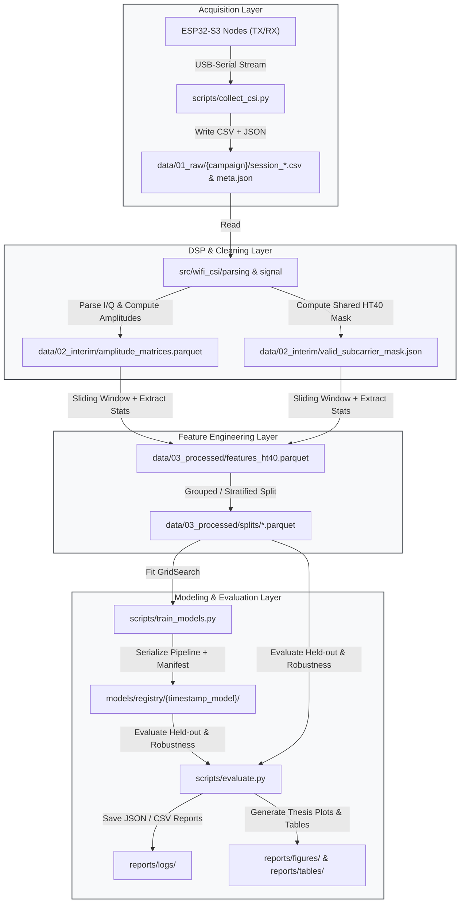

# Wi-Fi CSI Presence Detection: Repository Architecture & Standardization Proposal

**Project:** Wi-Fi CSI Presence Detection (Binary Human Presence Detection via ESP32-S3 802.11n HT40 CSI)  
**Author:** Xavier (Undergraduate Thesis / Projeto de Fim de Curso - Engenharia de Controle e Automação, UFMG, 2026)  
**Document Status:** Architecture Proposal & Migration Blueprint  
**Target Audience:** Project Author, Academic Advisors, Thesis Review Committee, and Open-Source Contributors  
**Language:** English  

---

## 1. Executive Summary & Architectural Vision

This project demonstrates a fully functional, device-free human presence detection system leveraging Channel State Information (CSI) from Wi-Fi 802.11n signals collected by two low-cost ESP32-S3 nodes. By monitoring variations in multipath propagation across 192 OFDM subcarriers (162 shared valid HT40 subcarriers), the system extracts statistical time-domain features over sliding windows and achieves high binary classification accuracy ($F_1 = 0.9897$ on held-out test data) across multiple machine learning models (Gradient Boosting, SVM, Random Forest, MLP).

While the underlying engineering and signal processing pipeline are technically sound, the repository has evolved organically across multiple experimental campaigns (`first_test`, `pilot`, `main`), leading to structural entropy. 

### Core Architectural Goals
1. **Unidirectional Data Flow:** Eliminate circular dependencies where data flows from `data/` to `outputs/` and then back to `data/`.
2. **Separation of Concerns:** Separate data acquisition (serial streaming), library algorithms (`src/`), narrative exploration (`notebooks/`), pipeline execution (`scripts/`), persistent models (`models/`), and academic dissemination (`reports/`).
3. **Scientific Reproducibility:** Ensure any researcher can clone the repository, install a managed environment via `pyproject.toml`, and reproduce the entire pipeline (raw packets $\to$ features $\to$ trained models $\to$ thesis figures) with a single command (`make pipeline` or `make all`).
4. **Leak-Free Validation & Robustness:** Standardize dataset splitting strategies to account for temporal clustering and multi-session spatial variation (Leave-One-Session-Out and Grouped validation).
5. **Academic & Production Readiness:** Provide publication-grade figures, machine-independent metadata schemas, unified Scikit-Learn inference pipelines, and model cards.

---

## 2. Current State Diagnosis & Anti-Patterns

A comprehensive audit of the existing repository structure identified seven primary architectural vulnerabilities:

```
[Current Layout]
├── data/
│   ├── first_test/      <-- Historical campaign (exploratory)
│   ├── pilot/           <-- Pilot campaign (valid + invalid sessions)
│   ├── main/            <-- Main campaign (7 sessions G–M)
│   └── splits/          <-- FEATURE matrices saved as splits inside data/ (CIRCULAR!)
├── notebooks/           <-- Heavy business logic, serial capture, and chained steps
├── outputs/             <-- Mixed bag: EDA plots, pipeline features, models metrics
├── models/              <-- Unversioned, flat pickles; scaler disconnected from models
└── src/                 <-- Hollow package: features.py empty, heavy algorithms in notebooks
```

### 2.1. Circular and Inconsistent Data Lifecycle
- **The Data-Output Ping-Pong:** Raw CSI CSVs live in `data/pilot/` and `data/main/`. The feature extraction notebook (`pipeline_v1.ipynb`) outputs the extracted features to `outputs/pipeline_v1/features_v1_ht40.csv` and `.parquet`. Then, `04_modeling/01_split.ipynb` reads features from `outputs/pipeline_v1/` and saves train/val/test splits *back into* `data/splits/`. Finally, training scripts load `data/splits/` and write metrics back to `outputs/pipeline_v1/modeling/`.
- **Campaign-Centric vs. Lifecycle-Centric Storage:** Folders like `first_test`, `pilot`, and `main` group files by date and milestone rather than by data refinement tier (raw immutable dumps vs. cleaned time series vs. processed feature tables).
- **Hardcoded Machine-Specific Absolute Paths:** The session metadata files (`*_meta.json`) store local workstation paths (e.g., `"/home/xavier/dev/wifi-csi-presence-detection/data/main/session_G_empty_20260922_1701.csv"`). When cloned onto another machine or run in a container, these paths break automated discovery.

### 2.2. Hollow `src/` and "Notebooks-as-Codebase"
- **Code Trapped in Notebook Cells:** `src/features.py` is an empty file containing only a docstring. Critical algorithms - such as complex CSI string parsing, subcarrier mask calculation, Butterworth filtering, active interval segmentation, and statistical feature calculations (`var`, `mad`, `range`, `iqr`) - are implemented directly inside Jupyter cells (`pipeline_v1.ipynb` and `eda_main.ipynb`).
- **Sys.path Injection Hacks:** Because `src/` is not configured as an installable Python package, almost every modeling notebook contains boilerplate sys.path manipulation:
  ```python
  _p = Path.cwd()
  for ROOT in [_p, *_p.parents]:
      if (ROOT / "requirements.txt").exists():
          break
  sys.path.insert(0, str(ROOT / "src"))
  ```
- **Zero Automated Testing:** Because business logic resides in `.ipynb` files, unit testing with `pytest` is impossible. A change in subcarrier filtering cannot be validated automatically.

### 2.3. Fragile Micro-Notebook Chaining
- Modeling is split across five tightly coupled notebooks:
  `01_split.ipynb` $\to$ `02_preprocessing.ipynb` $\to$ `03_training.ipynb` $\to$ `04_evaluation.ipynb` $\to$ `05_robustness.ipynb`.
- Execution depends on manual, sequential user interaction. Re-running `01_split` with a different random state leaves downstream notebooks in an inconsistent state unless the user manually re-executes all five notebooks in sequence.

### 2.4. Sprawl and Mixing in `outputs/`
- `outputs/` contains a mixture of:
  - Exploratory EDA PNGs (`outputs/main/plot1_...png`)
  - Intermediate pipeline datasets (`features_v1_ht40.csv`, `valid_subcarrier_mapping_v1.csv`)
  - Execution logs (`pipeline_report_v1.json`)
  - Model evaluation figures and CSV reports (`outputs/pipeline_v1/modeling/`)
- There is no distinction between transient diagnostic plots (useful only during debugging) and publication-ready assets intended for the UFMG undergraduate thesis or SBrT conference paper.

### 2.5. Model Serving and Serialization Risks
- `models/scaler.pkl` is saved independently from `models/gradient_boosting.pkl` and `models/random_forest.pkl`.
- Serving or evaluating this model requires manually loading two distinct pickle files and ensuring feature order matches exactly. If a single subcarrier feature is reordered, predictions degrade silently.
- Pickle (`.pkl`) files lack metadata: there is no record of the Git commit, hyperparameter search space, valid subcarrier mask, window length, or training date attached to the weights.

### 2.6. Hardware Acquisition Bound to Jupyter
- `notebooks/00_acquisition/csi_collector_v2.ipynb` executes long-running PySerial capture inside a notebook cell.
- Jupyter kernels are prone to browser disconnects, UI freezes, and interrupted background threads, creating risks of buffer overrun and corrupted CSV writes during long recordings.

### 2.7. Uncurated Dependency Management
- `requirements.txt` is an unstructured `pip freeze` of 117 packages containing local system dependencies.
- No `pyproject.toml` exists to declare core runtime dependencies, development tools (`pytest`, `ruff`), or project metadata.

---

## 3. Proposed Definitive Architecture

The proposed structure adheres to **Cookiecutter Data Science (CCDS v2)**, **Scikit-Learn Production Best Practices**, and **IEEE Reproducible Research Guidelines**, tailored specifically to IoT RF sensing systems.

```text
wifi-csi-presence-detection/
├── .gitignore                          # Comprehensive ignore rules (data, models, outputs)
├── LICENSE                             # Project license (MIT)
├── Makefile                            # Reproducible automation targets (collect, pipeline, train, test)
├── README.md                           # High-level project presentation & quickstart
├── pyproject.toml                      # PEP 517/518/621 package & dependency specifications
│
├── configs/                            # Central configuration files (YAML)
│   ├── acquisition.yaml                # Serial port, baudrate, protocol, timeouts
│   ├── pipeline.yaml                   # Windows, subcarrier thresholds, filter cutoffs
│   └── models.yaml                     # Search grids, CV folds, seeds, evaluation metrics
│
├── data/                               # Data storage (Unidirectional Medallion/CCDS architecture)
│   ├── 01_raw/                         # Immutable raw acquisition dumps (CSV + sidecar JSON)
│   │   ├── first_test/                 # Historic benchmark campaign (April 2026)
│   │   ├── pilot/                      # Pilot campaign (May 2026, sessions A–F)
│   │   └── main/                       # Main campaign (Sept 2026, sessions G–M)
│   ├── 02_interim/                     # Cleaned, time-aligned, calibrated CSI arrays
│   │   ├── amplitude_matrices.parquet  # Extracted subcarrier amplitudes per session
│   │   └── valid_subcarrier_mask.json  # Computed shared valid subcarrier index list
│   └── 03_processed/                   # Final canonical feature datasets & partition splits
│       ├── features_ht40.parquet       # Windowed statistical feature table (var, mad, etc.)
│       └── splits/                     # Canonical, reproducible split partitions
│           ├── train.parquet
│           ├── val.parquet
│           ├── test.parquet
│           └── split_metadata.json     # Splitting parameters, random seed, session mapping
│
├── docs/                               # Project documentation & academic notes
│   ├── INDEX.md                        # Documentation suite master index
│   ├── HARDWARE_AND_ACQUISITION.md     # Node mounting, antenna specs, room coordinates, protocol
│   ├── DATASET_AND_SESSIONS.md         # Campaign inventory, spatial topologies, quality criteria
│   ├── SIGNAL_PROCESSING_AND_FEATURES.md # I/Q decoding, subcarrier masks, 648 statistical features
│   ├── STATISTICAL_ANALYSIS_AND_SEPARABILITY.md # PCA, LDA, and ANOVA statistical separability
│   ├── MODELING_AND_BENCHMARKS.md      # 10-fold CV, held-out evaluation, 4-axis robustness
│   └── REPO_STRUCTURE_PROPOSAL.md      # Repository architecture specification
│
├── models/                             # Trained models, pipelines, and registries
│   ├── registry/                       # Versioned model artifacts with metadata
│   │   ├── 20260923_gradient_boosting/
│   │   │   ├── pipeline.joblib         # Bundled Pipeline(StandardScaler + Classifier)
│   │   │   ├── model_card.json         # Hyperparameters, metrics, subcarrier mask, git hash
│   │   │   └── feature_names.json      # Ordered feature column names
│   │   └── 20260923_random_forest/
│   │       ├── pipeline.joblib
│   │       └── model_card.json
│   └── baseline/                       # Pinned baseline models for continuous comparison
│
├── notebooks/                          # Narrative exploration & academic visualization ONLY
│   ├── 01_acquisition_check.ipynb      # Quick visual verification of live/recent serial capture
│   ├── 02_eda_raw_signals.ipynb        # Signal inspection (RSSI, phase sanity, amplitude noise)
│   ├── 03_eda_subcarrier_analysis.ipynb# Subcarrier discriminability & variance profiles
│   ├── 04_pipeline_diagnostics.ipynb   # Inspection of windowing, filtering, and PCA separability
│   └── 05_model_interpretation.ipynb   # Feature importance, error analysis, edge cases
│
├── reports/                            # Generated publication & thesis deliverables
│   ├── figures/                        # High-resolution (300+ DPI / Vector PDF) final figures
│   │   ├── fig01_room_geometry.pdf     # TX/RX node & subject positions map
│   │   ├── fig02_subcarrier_profile.png# Subcarrier variance under empty vs. occupied
│   │   ├── fig03_lda_projection.pdf    # LDA / PCA separation manifold
│   │   ├── fig04_confusion_matrices.pdf# Test set confusion matrix
│   │   └── fig05_robustness_analysis.pdf# Performance across room positions & time of day
│   ├── tables/                         # LaTeX & Markdown tables for thesis insertion
│   │   ├── model_comparison.tex        # Accuracy, F1, FAR across all tested algorithms
│   │   └── robustness_breakdown.tex    # Per-session and per-position metrics
│   └── logs/                           # Automated pipeline and execution reports
│       ├── pipeline_run_latest.json    # Complete metadata dump of last feature build
│       └── evaluation_report.json      # Test evaluation & robustness metrics
│
├── scripts/                            # Headless CLI entry points (reproducible execution)
│   ├── collect_csi.py                  # Standalone CLI serial collector daemon
│   ├── run_pipeline.py                 # CLI: raw data -> subcarrier mask -> features -> splits
│   ├── train_models.py                 # CLI: grid search, CV, pipeline bundling, model registration
│   ├── evaluate.py                     # CLI: test evaluation, confusion matrices, robustness tables
│   └── export_thesis_assets.py         # CLI: generate all publication-ready figures & LaTeX tables
│
├── src/                                # Reusable, modular Python library (pip install -e .)
│   └── wifi_csi/                       # Core library namespace
│       ├── __init__.py                 # Version and package exports
│       ├── acquisition/                # Hardware & Serial stream parsing
│       │   ├── __init__.py
│       │   ├── serial_reader.py        # Robust PySerial reader with buffer recovery
│       │   └── metadata_logger.py      # Sidecar JSON generator with relative paths
│       ├── core/                       # Foundational domain objects & schemas
│       │   ├── __init__.py
│       │   ├── config.py               # Pydantic or dataclass configuration parsers
│       │   ├── constants.py            # HT40 constants (192 subcarriers, sampling rates)
│       │   └── session.py              # CSISession domain class (encapsulates CSV + JSON)
│       ├── parsing/                    # Raw CSI packet & payload decoding
│       │   ├── __init__.py
│       │   ├── csv_parser.py           # Fast CSV reading and column conversion
│       │   ├── csi_decoder.py          # Vectorized string "[I,Q,...]" -> complex ndarray
│       │   └── metadata_parser.py      # Relative path resolution and timing validation
│       ├── signal/                     # CSI DSP and signal processing
│       │   ├── __init__.py
│       │   ├── amplitudes.py           # Complex I/Q to Euclidean amplitude & phase
│       │   ├── subcarrier_filter.py    # Static/dead subcarrier detection & shared masking
│       │   ├── denoise.py              # Butterworth lowpass & Daubechies wavelet filters
│       │   └── segmentation.py         # Temporal window slicing with sample-rate checks
│       ├── features/                   # Feature extraction algorithms
│       │   ├── __init__.py
│       │   ├── statistical.py          # Variance, MAD, IQR, Range per window
│       │   └── extractor.py            # Orchestrator applying features across valid subcarriers
│       ├── models/                     # ML modeling, tuning, and packaging
│       │   ├── __init__.py
│       │   ├── builder.py              # Factory for Scikit-Learn Pipelines (Scaler + Estimator)
│       │   ├── splitting.py            # Stratified, Grouped, and Leave-One-Session-Out splitters
│       │   ├── tuning.py               # Grid/RandomizedSearchCV with cross-validation
│       │   └── serialization.py        # Bundle saving, loading, and model card generation
│       ├── evaluation/                 # Metrics, benchmarking, and reporting
│       │   ├── __init__.py
│       │   ├── metrics.py              # Accuracy, F1-macro, False Alarm Rate (FAR)
│       │   ├── robustness.py           # Performance by position, distance, time-of-day
│       │   └── plotting.py             # Publication-ready Matplotlib & Seaborn stylers
│       └── utils/                      # Common utilities
│           ├── __init__.py
│           ├── io.py                   # Atomic Parquet/CSV/JSON reader/writer helpers
│           └── logging.py              # Formatted console logger
│
└── tests/                              # Automated test suite (pytest)
    ├── conftest.py                     # Synthetic CSI fixtures and test session builders
    ├── unit/
    │   ├── test_csi_decoder.py         # Verify I/Q string to complex array parsing
    │   ├── test_signal_filters.py      # Butterworth, masking, and amplitude calculations
    │   ├── test_features.py            # Verify variance, MAD, IQR, and column naming
    │   ├── test_pipeline_builder.py    # Verify Scikit-Learn Pipeline bundling
    │   └── test_metrics.py             # Verify FAR, F1, and accuracy computations
    └── integration/
        └── test_pipeline_e2e.py        # End-to-end: raw synthetic CSV -> features -> training -> inference
```

---

## 4. Architectural Deep-Dive & Key Design Decisions

### 4.1. The Unidirectional Data Engine

The redesigned data directory replaces the circular flow with an immutable three-tier hierarchy:



#### Tier Rules:
1. **`data/01_raw/` (Immutable):** Contains raw CSVs and `*_meta.json` files exactly as written by the serial logger. Once saved, these files are strictly read-only. They are organized by experimental campaign (`first_test`, `pilot`, `main`).
2. **`data/02_interim/` (Decoded & Calibrated):** Stores intermediate arrays where the raw string `data` column has been decoded into numerical complex CSI matrices ($N_{\text{packets}} \times 192$), filtered, and associated with the computed shared valid subcarrier mask.
3. **`data/03_processed/` (Canonical Features):** Contains the tabular feature matrices ($N_{\text{windows}} \times N_{\text{features}}$) and the partition splits (`train.parquet`, `val.parquet`, `test.parquet`). `outputs/` no longer hosts data files.

### 4.2. Relative Paths in Metadata Sidecars
To resolve the machine-dependent path issue, metadata sidecars will record strictly relative paths or rely on session IDs:
```json
{
  "schema_version": "2.1",
  "session": {
    "id": "G",
    "campaign": "main",
    "label": "empty",
    "files": {
      "csv": "session_G_empty_20260922_1701.csv",
      "json": "session_G_empty_20260922_1701_meta.json"
    }
  }
}
```
The parser dynamically resolves files relative to the project root or the directory where the JSON resides, enabling the repository to run seamlessly across Linux, macOS, Windows, and CI environments.

### 4.3. Unified Scikit-Learn Pipelines vs. Disconnected Pickles
In the existing codebase, `scaler.pkl` and `gradient_boosting.pkl` are stored separately:
```python
# CURRENT FRAGILE APPROACH (04_evaluation.ipynb)
scaler = joblib.load("models/scaler.pkl")
model = joblib.load("models/gradient_boosting.pkl")
X_scaled = scaler.transform(X_test)
y_pred = model.predict(X_scaled)
```
If feature scaling is changed (e.g., from `StandardScaler` to `RobustScaler` or `MinMaxScaler`), or if a feature column is omitted, the model will produce erroneous predictions without warning.

**The Proposed Standardization:**
All preprocessing and classification steps are encapsulated in a single `sklearn.pipeline.Pipeline`:
```python
from sklearn.pipeline import Pipeline
from sklearn.preprocessing import StandardScaler
from sklearn.ensemble import GradientBoostingClassifier

pipeline = Pipeline([
    ("scaler", StandardScaler()),
    ("classifier", GradientBoostingClassifier(n_estimators=100, learning_rate=0.1, random_state=42))
])

# Fit atomically on training set
pipeline.fit(X_train, y_train)

# Inference is atomic and safe
y_pred = pipeline.predict(X_test)
```
Each saved model directory will also include a `model_card.json` containing:
- Commit SHA and training timestamp
- Cross-validation performance ($F_1$, Accuracy, FAR)
- Test set performance
- Selected hyperparameters
- The exact list and order of input feature names
- Hardware and environmental constraints (e.g., HT40, 162 subcarriers, 2.0 s window)

### 4.4. Decoupling Acquisition from Notebooks
Running serial communication in a notebook (`notebooks/00_acquisition/csi_collector_v2.ipynb`) creates operational friction during data collection campaigns. 

The proposed architecture introduces `scripts/collect_csi.py`, a dedicated CLI tool powered by `src/wifi_csi/acquisition/`:
```bash
python scripts/collect_csi.py \
  --port /dev/ttyACM0 \
  --baud 921600 \
  --duration 690 \
  --label occupied_p1_still \
  --campaign main \
  --session-id N
```
**Benefits:**
- Native OS terminal signal handling (graceful handling of `Ctrl+C` to ensure all buffered packets are flushed to disk).
- Automated timing marker capture ($t_0$ start, $t_1$ condition start, $t_2$ condition stop, $t_3$ recording stop).
- Live ANSI terminal summary of received packet count, dropped frames, average RSSI, and effective sampling frequency without browser overhead.
- Immediate generation of the validated relative JSON metadata sidecar upon completion.

### 4.5. Clean Role for Jupyter Notebooks
Notebooks are valuable for scientific discovery, interactive visualization, and storytelling, but harmful when used as the primary storage for business logic.

Under the new architecture:
- **Notebooks do NOT define reusable functions:** All parsing, math, filtering, and model creation are imported from `src/wifi_csi`.
- **Notebooks are read-only exploratory views:** They load canonical data from `data/03_processed/` or interim arrays from `data/02_interim/` and display diagnostic plots or experiment with new analytical techniques (e.g., wavelet denoising, Doppler spectrograms).
- **Notebooks do NOT export production data:** Production artifacts are produced deterministically by `scripts/run_pipeline.py`.

---

## 5. Configuration & Reproducibility Specifications

### 5.1. Central Configuration (`configs/pipeline.yaml`)
Instead of hardcoding thresholds across notebooks, all constants are unified in a single configuration file:

```yaml
project:
  name: "wifi-csi-presence-detection"
  seed: 42

acquisition:
  serial_port: "/dev/ttyACM0"
  baudrate: 921600
  nominal_rate_hz: 29.0
  expected_subcarriers_raw: 384

preprocessing:
  window_seconds: 2.0
  min_samples_per_window: 10
  min_window_rate_fraction: 0.5
  subcarrier_mean_amp_threshold: 0.5
  min_shared_valid_subcarriers: 40
  filter:
    type: "none" # options: "none", "butterworth", "wavelet"
    butterworth_order: 3
    butterworth_cutoff_hz: 3.0

features:
  statistical: ["var", "mad", "range", "iqr"]

splitting:
  val_size: 0.15
  test_size: 0.15
  strategy: "stratified" # options: "stratified", "loso" (leave-one-session-out)

models:
  cv_folds: 10
  f1_pass_threshold: 0.90
```

### 5.2. Modern Project Packaging (`pyproject.toml`)
Adopting PEP 621 simplifies dependency management and eliminates the `sys.path` hack by allowing editable local installation (`pip install -e .`):

```toml
[build-system]
requires = ["setuptools>=61.0", "wheel"]
build-backend = "setuptools.build_meta"

[project]
name = "wifi-csi"
version = "0.2.0"
description = "Wi-Fi CSI Human Presence Detection using ESP32-S3"
authors = [{ name = "Xavier", email = "xavier@ufmg.br" }]
license = { text = "MIT" }
readme = "README.md"
requires-python = ">=3.10"
dependencies = [
    "numpy>=1.24.0",
    "scipy>=1.10.0",
    "pandas>=2.0.0",
    "scikit-learn>=1.3.0",
    "pyarrow>=12.0.0",
    "pyserial>=3.5",
    "matplotlib>=3.7.0",
    "seaborn>=0.12.0",
    "pyyaml>=6.0",
    "joblib>=1.3.0",
]

[project.optional-dependencies]
dev = [
    "pytest>=7.4.0",
    "pytest-cov>=4.1.0",
    "ruff>=0.1.0",
    "jupyterlab>=4.0.0",
]

[tool.setuptools.packages.find]
where = ["src"]

[tool.ruff]
line-length = 100
target-version = "py310"
```

### 5.3. Project Automation (`Makefile`)
A simple `Makefile` provides an interface to run any phase of the project:

```makefile
.PHONY: help install pipeline train evaluate test figures clean

help:
	@echo "Available commands:"
	@echo "  make install    - Install project in editable mode with dev tools"
	@echo "  make pipeline   - Process raw CSI data into feature splits"
	@echo "  make train      - Train all ML models and serialize best pipelines"
	@echo "  make evaluate   - Evaluate best model on test set and run robustness checks"
	@echo "  make figures    - Generate all high-res thesis/paper figures and tables"
	@echo "  make test       - Run automated test suite (pytest)"
	@echo "  make all        - Execute pipeline -> train -> evaluate -> figures"
	@echo "  make clean      - Remove intermediate caches, outputs, and build files"

install:
	pip install -e ".[dev]"

pipeline:
	python scripts/run_pipeline.py --config configs/pipeline.yaml

train:
	python scripts/train_models.py --config configs/models.yaml

evaluate:
	python scripts/evaluate.py --config configs/models.yaml

figures:
	python scripts/export_thesis_assets.py --output reports/

test:
	pytest tests/ -v

all: pipeline train evaluate figures

clean:
	find . -type d -name "__pycache__" -exec rm -rf {} +
	find . -type f -name "*.py[co]" -delete
	rm -rf build/ dist/ *.egg-info .pytest_cache/
```

---

## 6. Phased, Zero-Downtime Migration Plan

To transform the repository into this architecture without disrupting ongoing analysis or invalidating previous research findings, the migration is structured into four sequential phases.

### Phase 1: Foundation & Package Initialization (Non-Breaking)
*Goal: Enable standard imports without touching existing data or notebook paths.*
1. Create `pyproject.toml` in the repository root.
2. Initialize `configs/pipeline.yaml` and `configs/models.yaml` with the current parameters extracted from `pipeline_v1.ipynb` and `03_training.ipynb`.
3. Create the `src/wifi_csi/` package structure with submodules: `parsing`, `signal`, `features`, `models`, `evaluation`, and `utils`.
4. Migrate the functions currently stranded in `pipeline_v1.ipynb` and `04_modeling/` into their respective modules in `src/wifi_csi/`.
5. Install the package locally in editable mode: `pip install -e .`.
6. Add unit tests in `tests/unit/` to verify that migrated functions produce output identical to the current notebooks.

### Phase 2: Data Directory Reorganization & Path Normalization
*Goal: Establish the 3-tier data layout and eliminate circular paths.*
1. Create `data/01_raw/`, `data/02_interim/`, and `data/03_processed/`.
2. Move `data/first_test`, `data/pilot`, and `data/main` into `data/01_raw/`.
3. Move `outputs/pipeline_v1/features_v1_ht40.parquet` to `data/03_processed/features_ht40.parquet`.
4. Move `data/splits/` into `data/03_processed/splits/`.
5. Update `*_meta.json` sidecars to eliminate absolute file paths, using relative filenames instead.
6. Update `.gitignore` to match the new tiered data layout.

### Phase 3: Script Automation & Pipeline Unification
*Goal: Replace micro-notebook chaining with deterministic CLI scripts.*
1. Implement `scripts/run_pipeline.py`: Loads raw data from `data/01_raw/`, calculates amplitudes, extracts features, and creates canonical splits in `data/03_processed/`.
2. Implement `scripts/train_models.py`: Loads splits, fits bundled `sklearn.pipeline.Pipeline` models, and saves registered pipelines to `models/registry/`.
3. Implement `scripts/evaluate.py`: Generates confusion matrices, metrics reports, and robustness tables directly into `reports/`.
4. Create the `Makefile` with targets: `install`, `pipeline`, `train`, `evaluate`, `test`.

### Phase 4: Notebook Consolidation & Documentation Polish
*Goal: Streamline notebooks to clean, narrative-driven presentation tools.*
1. Deprecate `pipeline_v0.ipynb` and archive obsolete first-test EDA files into an `archive/` folder or keep only the consolidated `04_pipeline_diagnostics.ipynb`.
2. Refactor `04_modeling/01_split` through `05_robustness` into a single, clean narrative notebook: `notebooks/05_model_interpretation.ipynb` that loads the pre-computed metrics and models from `models/registry/` and `reports/logs/`.
3. Create `scripts/collect_csi.py` for headless terminal acquisition.
4. Update `README.md` to reflect the final directory tree and quickstart commands.

---

## 7. Comparative Summary: Current vs. Proposed

| Dimension | Current State | Proposed State |
|---|---|---|
| **Data Directory** | Campaigns mixed with feature splits (`data/splits`); circular flow | Strict 3-tier layout (`01_raw`, `02_interim`, `03_processed`); clean unidirectional flow |
| **Data Flow** | `data/` $\to$ `outputs/` $\to$ `data/splits/` $\to$ `models/` $\to$ `outputs/` | `01_raw` $\to$ `02_interim` $\to$ `03_processed` $\to$ `models/` $\to$ `reports/` |
| **Python Package** | `src/` is an afterthought; `features.py` is empty; sys.path hacks | `src/wifi_csi` is a fully tested, installable Python package (`pip install -e .`) |
| **Algorithm Location** | Trapped inside notebook cells | Cleanly modularized in `src/wifi_csi/`, importable by scripts and notebooks |
| **Notebooks** | Heavy execution engines; chained sequentially (5 micro-notebooks) | Lightweight narrative & diagnostic views; zero sequential dependency |
| **Configuration** | Constants hardcoded across multiple `.ipynb` files | Centralized YAML configurations in `configs/` |
| **Model Storage** | Flat, unversioned `.pkl` files; scaler disconnected from model | Bundled Scikit-Learn `Pipeline(scaler + model)` in versioned registry with `model_card.json` |
| **Hardware Acquisition** | Long serial loops run inside a Jupyter notebook cell | Standalone CLI daemon (`scripts/collect_csi.py`) with signal handling and relative JSON sidecars |
| **Outputs & Reports** | Unstructured `outputs/` folder mixing data, logs, and plots | Dedicated `reports/figures/` (vector/300 DPI) and `reports/tables/` (LaTeX ready) |
| **Testing & CI** | Zero tests; cannot test notebook cells | Comprehensive `pytest` suite for parsing, signal processing, and model inference |
| **Automation** | Manual execution of 10+ notebooks in a specific order | Single command (`make all` or `make pipeline`) via `Makefile` |

---

## 8. Conclusion & Next Steps

Adopting this definitive architecture will transform the repository from an exploratory research workspace into a modular, production-grade, and scientifically reproducible codebase. It provides immediate benefits for completing the undergraduate thesis (PFC) at UFMG and preparing the paper submission for the Brazilian Telecommunications Symposium (SBrT):

- Thesis figures and tables can be regenerated automatically with updated formatting at any time.
- The separation between raw data, features, and models prevents accidental data leakage.
- Future researchers can extend the codebase to new environments, additional ESP32 nodes, or multi-class activity recognition without refactoring the foundational architecture.

Once this proposal is approved, migration can begin following the phased plan outlined in **Section 6**.
