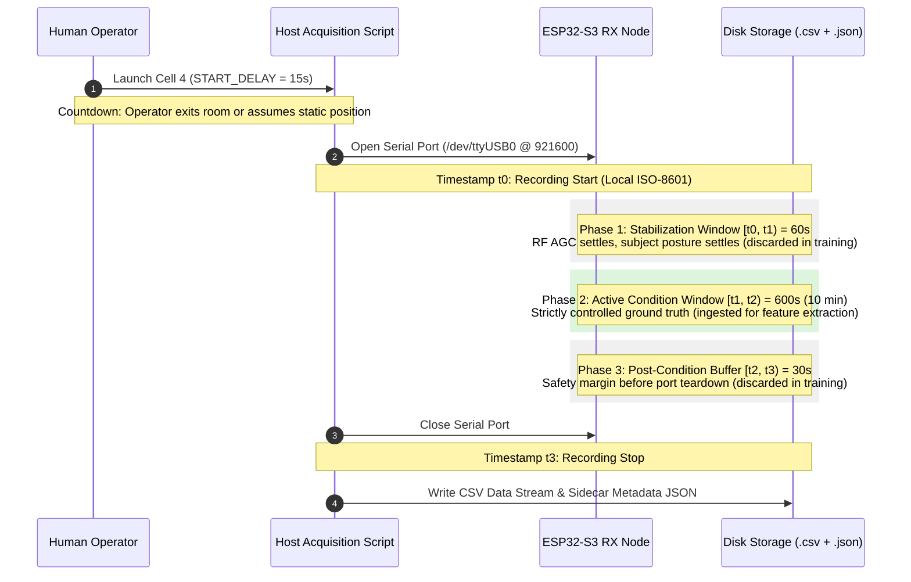

> **Notice:** This documentation was automatically generated by AI to provide a comprehensive textual reference of the technical workflows and notebook implementations.

# Stage 0: Data Acquisition and Hardware Protocol

## 1. Executive Summary & Objective

The primary objective of the data acquisition stage is to establish a rigorous, deterministic, and physically calibrated data collection pipeline for device-free human presence detection using Wi-Fi Channel State Information (CSI). In indoor multipath environments, the presence, posture, and subtle displacements of a human body introduce dynamic absorption, reflection, and phase shifts across radio frequency (RF) paths. Traditional metrics such as the Received Signal Strength Indicator (RSSI) provide only a coarse scalar measure of received power across the entire channel, rendering them susceptible to multipath fading, hardware gain adjustments, and blind spots away from the direct Line-of-Sight (LoS).

In contrast, Channel State Information captures fine-grained physical layer (PHY) channel frequency response (CFR) measurements across individual Orthogonal Frequency-Division Multiplexing (OFDM) subcarriers. To capture these subtle perturbations without requiring human subjects to carry wearable devices or installing invasive optical cameras, this project employs low-cost, off-the-shelf ESP32-S3 microcontrollers operating in IEEE 802.11n High Throughput 40 MHz (HT40) mode.

The acquisition protocol is implemented primarily through the interactive notebook [`csi_collector_v2.ipynb`](file:///home/xavier/dev/wifi-csi-presence-detection/notebooks/00_acquisition/csi_collector_v2.ipynb) alongside the [`wifi_csi.acquisition`](file:///home/xavier/dev/wifi-csi-presence-detection/src/wifi_csi/acquisition/__init__.py) package. This system guarantees:
1. High-throughput, non-blocking serial acquisition over USB-UART running at 921,600 baud.
2. Synchronized host-level microsecond timestamping paired with hardware microsecond timer logging.
3. Decoupled, schema-validated sidecar metadata (`*_meta.json`) recording experimental geometry, environmental telemetry, and timing landmarks.
4. Strict temporal boundaries comprising pre-recording countdowns, RF/AGC stabilization intervals, active condition windows, and post-recording buffer windows.

---

## 2. Hardware Architecture & Testbed Topology

### 2.1 Hardware Specifications

The acquisition link consists of two dedicated nodes built on the Espressif ESP32-S3-DevKitC-1U-N8R8 platform:

| Component | Specification | Operational Role |
| :--- | :--- | :--- |
| **Microcontroller (MCU)** | ESP32-S3 (Xtensa® dual-core 32-bit LX7 @ 240 MHz) | Core baseband processing, FreeRTOS Wi-Fi stack execution |
| **Memory Architecture** | 512 KB internal SRAM, 8 MB SPI Flash, 8 MB Octal PSRAM | High-speed ring buffers, CSI frame parsing, memory caching |
| **RF Transceiver** | Integrated 2.4 GHz 802.11b/g/n (1T1R Wi-Fi 4) | OFDM packet modulation, transmission, and baseband demodulation |
| **Antenna Interface** | External 3 dBi omnidirectional dipole antenna (U.FL connector) | Spatial radiation pattern, multipath capture |
| **Tripod Mounts** | Precision aluminum tripods with 3-way pan heads | Rigid node positioning at calibrated height and orientation |
| **Power Delivery (TX)** | 10,000 mAh portable DC power bank (5 V / 2.4 A) | Electrically isolated DC source; eliminates 60 Hz mains hum and ground loops |
| **Power & Logging (RX)**| High-speed shielded USB connection to host PC | Power delivery and continuous 921,600 baud serial telemetry streaming |

### 2.2 Functional Roles: Dedicated Link Topology

The two nodes operate in a dedicated, simplex sensing link designed to eliminate non-deterministic network overhead:

- **Transmitter (TX Node):** Configured as a Wi-Fi Station (STA) with a fixed MAC address (`1a:00:00:00:00:00`). It injects regular ICMP echo request packets (or raw frames) directed to the Access Point at a constant nominal rate of $30\text{ Hz}$ ($T_{\text{nominal}} = 33.33\text{ ms}$). Powered by a battery bank, it remains completely uncoupled from the host workstation and mains electricity.
- **Receiver (RX Node):** Configured as a Wi-Fi Access Point (AP) broadcasting the dedicated SSID `CSI_AP` on primary RF channel 11 with BSSID `1c:db:d4:9d:93:dc`. The ESP-IDF CSI capture subsystem is enabled on the RX node. For every valid incoming frame from the TX MAC address, the hardware physical layer decodes the OFDM preamble, computes the channel estimation matrix, triggers an internal interrupt callback (`wifi_csi_cb_t`), formats the CSI payload and control headers into an ASCII record, and transmits it over UART to the host PC.

```mermaid
flowchart LR
    subgraph TX_Node ["Transmitter (TX Node)"]
        BAT["10,000 mAh Power Bank<br/>(Ground-Isolated)"] --> ESP_TX["ESP32-S3-DevKitC-1U<br/>STA (1a:00:00:00:00:00)"]
        ESP_TX --> ANT_TX["3 dBi Dipole<br/>(Height: 1.20 m)"]
    end

    ANT_TX -- "2.4 GHz 802.11n HT40<br/>30 Hz Ping Packet Train" --> CHAN["Indoor Multipath Channel<br/>(LoS: 2.00 m Baseline)"]
    CHAN --> ANT_RX["3 dBi Dipole<br/>(Height: 1.20 m)"]

    subgraph RX_Node ["Receiver (RX Node)"]
        ANT_RX --> ESP_RX["ESP32-S3-DevKitC-1U<br/>AP 'CSI_AP' (1c:db:d4:9d:93:dc)"]
        ESP_RX -- "Raw CSI Frame<br/>(384 Bytes I/Q + Header)" --> UART["USB-UART Bridge<br/>921,600 Baud"]
    end

    UART -- "Serial Stream" --> PC["Host Logging Station<br/>csi_collector_v2.ipynb<br/>timestamp_host Injection"]
    PC --> DISK[("data/01_raw/<br/>.csv + _meta.json")]
```



### 2.3 Physical Environment & Coordinate Reference Frame

The primary benchmark testbed was deployed in a residential bedroom representative of real-world smart-building applications.

- **Physical Dimensions:**
  - East-West width: $3.40\text{ m}$
  - North-South length: $3.45\text{ m}$
  - Floor-to-ceiling height: $2.85\text{ m}$
  - Total floor area: $11.73\text{ m}^2$
  - Enclosed volume: $33.43\text{ m}^3$
- **Boundary Construction:** Structural brick masonry walls finished with plaster; reinforced concrete floor slab and ceiling; single plywood interior door ($0.80\text{ m} \times 2.10\text{ m}$) situated on the east wall; iron-frame exterior window with glass panes on the north wall.
- **Interior Clutter & Multipath Scatterers:** Static domestic furniture including a standard double bed (fabric and wood frame), an MDF wardrobe with full-height mirrors, a wooden study desk, an office chair, and two wall-mounted bookshelf niches.

The testbed adopts a 2D Cartesian coordinate frame $(x, y)$ with its origin $(0, 0)$ positioned at the northwest interior corner of the room:
- $+X$ axis: Directed East along the north wall ($0.00\text{ m} \le x \le 3.40\text{ m}$).
- $+Y$ axis: Directed South along the west wall ($0.00\text{ m} \le y \le 3.45\text{ m}$).
- Mounting elevation: Both TX and RX antennas are leveled at $z = 1.20\text{ m}$ above the floor surface, corresponding to the approximate center-of-mass and chest height of an adult human subject.

```text
                        North Wall
  (0.0, 0.0) ┌─────────────────────────┐       (3.40, 0.0)
             │                         │     
Plywood Door │        [RX Node]        │    
             │        (1.45, 1.14)     └─────┐
             │             │                 │
             │             │                 │  
  West Wall  │             │ 2.00 m LoS      │  East Wall
             │             │                 │
             │        [TX Node]              │
             │        (1.45, 3.08)           │
             │                               │
  (0.0, 3.45)└───────────────────────────────┘ (3.40, 3.45)
              South Wall (Iron & Glass Window)
```

### 2.4 Node Coordinates & Line-of-Sight Geometry

- **RX Node Position:** $(x_{\text{RX}}, y_{\text{RX}}) = (1.45\text{ m}, 1.14\text{ m})$
- **TX Node Position:** $(x_{\text{TX}}, y_{\text{TX}}) = (1.45\text{ m}, 3.08\text{ m})$
- **Line-of-Sight (LoS) Axis:** The direct link lies along the line $x = 1.45\text{ m}$, oriented parallel to the North-South room axis.
- **LoS Baseline Distance:** $d_{\text{LoS}} = |y_{\text{TX}} - y_{\text{RX}}| = 3.08 - 1.14 = 1.94\text{ m}$ (nominal direct path separation: $2.00\text{ m}$).
- **Geometric Midpoint:** $(x_c, y_c) = (1.45\text{ m}, 2.11\text{ m})$.

---

## 3. Radio Frequency & 802.11n HT40 Physical Layer

### 3.1 Channel Allocation and Spectral Mask

To maximize the spectral resolution of the channel frequency response, the acquisition system utilizes 802.11n High Throughput 40 MHz (HT40) channel bonding in the 2.4 GHz Industrial, Scientific, and Medical (ISM) band:

- **Primary Channel:** Channel 11 ($f_1 = 2462\text{ MHz}$).
- **Secondary Channel Extension:** Configured with `secondary_channel = 2`, indicating that the secondary 20 MHz channel is located below the primary channel (Channel 7, $f_2 = 2442\text{ MHz}$).
- **Center Operating Frequency:** 
  $$f_c = \frac{f_1 + f_2}{2} = \frac{2462 + 2442}{2} = 2452\text{ MHz}$$
- **Total Channel Bandwidth:** $40\text{ MHz}$ spanning the RF band from $2432\text{ MHz}$ to $2472\text{ MHz}$.

### 3.2 PHY Layer Parameters

The link operates under fixed physical layer modulation parameters to ensure that changes in CSI amplitude and phase originate strictly from environmental multipath alterations rather than dynamic rate adaptation:

- **Modulation and Coding Scheme:** HT-MCS 0 (BPSK modulation with convolutional coding rate $R = 1/2$).
- **Spatial Streams:** Single spatial stream ($N_{SS} = 1, 1\times 1 \text{ SISO}$).
- **Guard Interval:** Standard $800\text{ ns}$ Guard Interval (`sgi = 0`).
- **Space-Time Block Coding (STBC):** Disabled (`stbc = 0`).
- **Forward Error Correction:** Binary Convolutional Coding (`fec_coding = 0`).
- **Frame Aggregation:** A-MPDU aggregation disabled (`aggregation = 0`, `ampdu_cnt = 0`) to preserve packet-level temporal granularity.

### 3.3 OFDM Subcarrier Structure

In an 802.11n HT40 channel, the baseband Inverse Fast Fourier Transform (IFFT) / Fast Fourier Transform (FFT) operates over a 128-point transform for each 20 MHz subchannel, producing a 256-bin spectrum. The ESP32-S3 baseband engine extracts and reports $N_{\text{sub}} = 192$ complex subcarrier coefficients per received frame (`HT40_N_SUBCARRIERS = 192` in [`constants.py`](file:///home/xavier/dev/wifi-csi-presence-detection/src/wifi_csi/core/constants.py#L3)):

- **Subcarrier Spacing:** $\Delta f = 312.5\text{ kHz}$.
- **Active Subcarriers:** Data subcarriers ($108$ per 20 MHz half-channel) and pilot subcarriers ($6$ per 20 MHz half-channel) used for phase and frequency tracking.
- **Null Subcarriers:** The 192 reported bins span data carriers, pilots, guard band subcarriers at band edges, and the central Direct Current (DC) subcarrier ($0\text{ Hz}$ baseband offset). Guard and DC subcarriers register zero or near-zero amplitude and are filtered out during preprocessing.

---

## 4. CSI Packet Structure & Serialization Protocol

### 4.1 Espressif CSI Subsystem Mechanism

The ESP32-S3 firmware enables the hardware CSI reception callback using the ESP-IDF API:
```c
esp_wifi_set_csi_rx_cb(&csi_rx_callback, NULL);
```
When an 802.11n frame is detected, the PHY layer demodulates the Long Training Field (HT-LTF). The channel estimation equalizer calculates the complex transfer function $H(f)$ for each subcarrier to invert channel distortions. The `wifi_csi_info_t` structure provides both receiver control metadata (`wifi_pkt_rx_ctrl_t`) and the raw CSI byte buffer.

### 4.2 UART Serial Stream & Bandwidth Budget

The receiver formats the packet into a single ASCII line prefixed with `CSI_DATA` and writes it over UART.

- **UART Baud Rate:** $921,600\text{ baud}$, 8 data bits, no parity, 1 stop bit (8-N-1).
- **Physical Byte Rate:** 
  $$\frac{921,600\text{ bits/s}}{10\text{ bits/byte}} = 92,160\text{ bytes/s}$$
- **Packet Length:** Each formatted CSV row averages $1,250\text{ bytes}$ (metadata headers plus a 384-element bracketed ASCII integer array).
- **Serial Channel Utilization:** At the nominal transmission rate of $30\text{ packets/s}$:
  $$\text{Throughput} = 30\text{ packets/s} \times 1,250\text{ bytes/packet} \times 10\text{ bits/byte} \approx 375,000\text{ bps} \quad (375\text{ kbps})$$
  $$\text{Bus Utilization} = \frac{375,000}{921,600} \approx 40.69\%$$
This 40.7% load provides adequate headroom, preventing hardware UART FIFO overruns and host serial buffer drops under sustained transmission.

### 4.3 Raw CSV Field Schema

Every line recorded in the raw dataset `.csv` file contains exactly 26 comma-separated fields:

```text
timestamp_host,type,id,mac,rssi,rate,sig_mode,mcs,bandwidth,smoothing,not_sounding,aggregation,stbc,fec_coding,sgi,noise_floor,ampdu_cnt,channel,secondary_channel,local_timestamp,ant,sig_len,rx_state,len,first_word,data
```

| Field Index | Field Name | Data Type | Example Value | Description & Physical Units |
| :---: | :--- | :--- | :--- | :--- |
| **0** | `timestamp_host` | String | `20260922T170343.370718` | Host PC reception timestamp injected by acquisition script (`%Y%m%dT%H%M%S.%f`). |
| **1** | `type` | String | `CSI_DATA` | Packet signature identifier emitted by receiver firmware. |
| **2** | `id` | Integer | `42206` | Monotonic frame sequence identifier from transmitter. |
| **3** | `mac` | String | `1a:00:00:00:00:00` | Transmitter hardware MAC address. |
| **4** | `rssi` | Integer | `-26` | Received Signal Strength Indicator in $\text{dBm}$ (quantized integer). |
| **5** | `rate` | Integer | `11` | Physical transmission rate index code (HT rate mapping). |
| **6** | `sig_mode` | Integer | `1` | Signal mode: 0 = non-HT (legacy 802.11a/g/b), 1 = HT (802.11n), 2 = VHT. |
| **7** | `mcs` | Integer | `0` | Modulation and Coding Scheme index ($0 = \text{BPSK } 1/2$). |
| **8** | `bandwidth` | Integer | `1` | RF channel bandwidth flag: 0 = 20 MHz, 1 = 40 MHz (HT40). |
| **9** | `smoothing` | Integer | `1` | Equalizer smoothing flag: 1 = smoothing recommended across subcarriers. |
| **10** | `not_sounding` | Integer | `1` | Frame sounding status: 1 = regular data frame, 0 = sounding frame. |
| **11** | `aggregation` | Integer | `0` | A-MPDU aggregation indicator: 0 = non-aggregated standalone packet. |
| **12** | `stbc` | Integer | `0` | Space-Time Block Coding indicator: 0 = disabled. |
| **13** | `fec_coding` | Integer | `0` | Forward Error Correction scheme: 0 = BCC (Binary Convolutional Code). |
| **14** | `sgi` | Integer | `0` | Short Guard Interval: 0 = standard 800 ns, 1 = 400 ns short GI. |
| **15** | `noise_floor` | Integer | `-96` | Background noise floor estimate in $\text{dBm}$ measured by RF front-end. |
| **16** | `ampdu_cnt` | Integer | `0` | Subframe count in aggregate payload (0 for ping packets). |
| **17** | `channel` | Integer | `11` | Primary RF channel number (2462 MHz). |
| **18** | `secondary_channel`| Integer | `2` | Secondary channel offset: 0 = none, 1 = above, 2 = below (HT40-). |
| **19** | `local_timestamp` | Integer | `1731067088` | On-chip microsecond hardware timer on the ESP32-S3 receiver. |
| **20** | `ant` | Integer | `0` | Receiving antenna port index (0 = primary external antenna). |
| **21** | `sig_len` | Integer | `47` | Length of payload frame in bytes. |
| **22** | `rx_state` | Integer | `0` | Demodulator status: 0 = successful frame reception without CRC error. |
| **23** | `len` | Integer | `384` | Number of signed 8-bit integer values in the CSI payload vector. |
| **24** | `first_word` | Integer | `0` | Buffer word offset alignment indicator in internal RAM. |
| **25** | `data` | Array String | `[0,0,0,0,...,-1,-9,...]` | Interleaved raw CSI byte sequence $[Q_0, I_0, Q_1, I_1, \dots, Q_{191}, I_{191}]$. |

### 4.4 CSI Mathematical Formulation & Complex Decoding

The `data` column contains an array of 384 signed 8-bit integers representing 192 complex numbers in an interleaved format. In the ESP-IDF baseband implementation, each subcarrier response is formatted as:

$$\mathbf{D} = [d_0, d_1, d_2, d_3, \dots, d_{382}, d_{383}]$$

where for subcarrier index $k \in \{0, 1, 2, \dots, 191\}$:
- Imaginary component ($Q_k$): $d_{2k} = \text{data}[2k]$
- Real component ($I_k$): $d_{2k+1} = \text{data}[2k + 1]$

As implemented in [`raw_iq_to_complex`](file:///home/xavier/dev/wifi-csi-presence-detection/src/wifi_csi/parsing/csi_decoder.py#L56-L65):
```python
imag = raw[0::2]
real = raw[1::2]
return real.astype(np.float64) + 1j * imag.astype(np.float64)
```

The complex Channel Frequency Response (CFR) for subcarrier $k$ is reconstructed as:
$$H(k) = I_k + j \cdot Q_k$$

From this complex number, the instantaneous amplitude and unwrapped phase are derived via:
$$|H(k)| = \sqrt{I_k^2 + Q_k^2}$$
$$\phi(k) = \operatorname{atan2}(Q_k, I_k)$$

---

## 5. Temporal Acquisition Protocol & Boundary Architecture

To prevent transient artifacts (such as operator door movements or footsteps when entering/exiting the room) from contaminating the labeled training dataset, [`csi_collector_v2.ipynb`](file:///home/xavier/dev/wifi-csi-presence-detection/notebooks/00_acquisition/csi_collector_v2.ipynb) enforces a deterministic four-phase acquisition sequence.



### 5.1 Protocol Phases & Durations

1. **Pre-Recording Countdown ($T_{\text{delay}} = 15\text{ s}$):** An automated countdown timer is triggered before opening the serial port. The operator uses this window to leave the room and close the door (in `empty` sessions) or stand motionless at the designated spatial mark (in `occupied` sessions).
2. **Stabilization Interval ($[t_0, t_1)$, $T_{\text{stab}} = 60\text{ s}$):** Logging begins at $t_0$. The first 60 seconds are discarded during feature extraction. This window allows:
   - Radio Frequency Automatic Gain Control (AGC) convergence.
   - Internal crystal oscillator thermal equilibrium.
   - Room air currents and subject physiological breathing rhythms to reach steady state.
3. **Active Ground-Truth Window ($[t_1, t_2)$, $T_{\text{active}} = 600\text{ s} = 10.0\text{ min}$):** The core acquisition window under verified ground-truth conditions. At $30\text{ Hz}$, this phase produces approximately $17,400\text{ samples}$ per session.
4. **Post-Condition Safety Buffer ($[t_2, t_3)$, $T_{\text{buffer}} = 30\text{ s}$):** A trailing buffer that ensures no premature movement by the operator or external perturbations contaminate the terminal segments of the active window.
5. **Total Recording Duration ($T_{\text{total}} = 690\text{ s} = 11.5\text{ min}$):**
   $$T_{\text{total}} = T_{\text{stab}} + T_{\text{active}} + T_{\text{buffer}} = 60\text{ s} + 600\text{ s} + 30\text{ s} = 690\text{ s}$$
   yielding approximately $20,000\text{ frames}$ per standard recording.

*Exception:* Session J was recorded with an extended active duration $T_{\text{active}} = 1800\text{ s}$ ($30.0\text{ min}$, total duration $1890\text{ s} = 31.5\text{ min}$, $55,075\text{ samples}$) to serve as an extended baseline for evaluating long-duration baseline drift and circadian environmental stability.

### 5.2 Temporal Synchronization Architecture

- **Host PC System Timestamp:** Host timestamps (`timestamp_host`) are acquired at serial line decode time via Python's `datetime.now().strftime("%Y%m%dT%H%M%S.%f")`, ensuring monotonic alignment with UTC-offset ISO-8601 timestamps in metadata sidecars.
- **Hardware Timer Cross-Check:** The embedded `local_timestamp` field (ESP32 hardware timer) is periodically cross-referenced against `timestamp_host` to detect packet queuing or serial driver buffering delays.
- **Midnight-Rollover Handling:** In sessions that traverse midnight UTC/local boundaries (such as Session K, spanning 23:53:51 to 00:05:21), the metadata parser [`get_active_interval_from_metadata`](file:///home/xavier/dev/wifi-csi-presence-detection/src/wifi_csi/parsing/metadata_parser.py#L61-L73) detects $t_2 < t_1$ and adds a one-day offset:
  ```python
  if not pd.isna(start) and not pd.isna(end) and end < start:
      end = end + pd.Timedelta(days=1)
  ```

---

## 6. Ground Truth Taxonomy & Spatial Diversity Matrix

The classification objective is binary presence detection:
$$\mathcal{Y} \in \{0, 1\} \quad (0 = \text{Empty}, 1 = \text{Occupied})$$

To evaluate model generalizability and prevent classifiers from keying on a single localized multipath profile, five distinct occupied scenarios were collected across three experimental campaigns.

```text
                     North Wall
  ┌─────────────────────────────────────────────────┐
  │                                                 │
  │                  [RX Node]                      │
  │                 (1.45, 1.14)                    │
  │                      │                          │
  │                      │ 30 cm                    │
  │                 [P3: Near RX] (1.45, 1.44)      │
  │                      │                          │
  │   30 cm              │              30 cm       │
  │ [P1: West] ──── [Center Mark] ──── [P4: East]   │
  │ (1.15, 2.11)    (1.45, 2.11)       (1.75, 2.11) │
  │                      │                          │
  │                      │ 30 cm                    │
  │                 [P2: Near TX] (1.45, 2.78)      │
  │                      │                          │
  │                  [TX Node]                      │
  │                 (1.45, 3.08)                    │
  │                                                 │
  └─────────────────────────────────────────────────┘
                South Wall (Window)
```

### 6.1 Condition Definitions & Physical Coordinates

| Condition Identifier | Binary Class | Physical Coordinates $(x, y)$ | Distance to LoS Axis | Orientation | Physical Propagation Mechanism |
| :--- | :---: | :---: | :---: | :--- | :--- |
| `empty` | 0 | Outside room | N/A | N/A | Static multipath baseline; room unoccupied, door and windows closed. |
| `occupied_still` | 1 | $(1.45, 2.11)\text{ m}$ | $0.00\text{ m}$ (On LoS) | Facing North (RX) | Center mark; full obstruction of direct first Fresnel zone. Subject motionless. |
| `occupied_moving` | 1 | $(1.45, 2.11)\text{ m}$ | $0.00\text{ m}$ (On LoS) | Facing North (RX) | Center mark; subject performing in-place postural shifting within $\pm 0.30\text{ m}$. |
| `occupied_p1_still` | 1 | $(1.15, 2.11)\text{ m}$ | $0.30\text{ m}$ (Off LoS West)| Facing North (RX) | Subject shifted $30\text{ cm}$ West; off direct LoS, perturbing secondary multipath reflections. |
| `occupied_p2_still` | 1 | $(1.45, 2.78)\text{ m}$ | $0.00\text{ m}$ (On LoS) | Facing North (RX) | Subject standing $30\text{ cm}$ in front of TX node; heavy direct attenuation of transmitted beam. |
| `occupied_p3_still` | 1 | $(1.45, 1.44)\text{ m}$ | $0.00\text{ m}$ (On LoS) | Facing North (RX) | Subject standing $30\text{ cm}$ in front of RX node; severe diffraction at receiver antenna. |
| `occupied_p4_still` | 1 | $(1.75, 2.11)\text{ m}$ | $0.30\text{ m}$ (Off LoS East)| Facing North (RX) | Subject shifted $30\text{ cm}$ East; off direct LoS, perturbing reflections off mirrored wardrobe. |

---

## 7. Sidecar Metadata Architecture (`*_meta.json`)

To prevent loss of contextual and experimental information, every `.csv` raw capture is accompanied by a companion `.json` metadata file using standardized schema versions (v2.0 / v2.1).

### 7.1 Metadata Schema Specification

The metadata file captures five structured blocks:
1. `schema_version`: String indicating specification version (`"2.0"` or `"2.1"`).
2. `session`: Session identifier, label, relative/canonical file paths, and planned duration.
3. `timing`: ISO-8601 timestamps for $t_0, t_1, t_2, t_3$, total samples, validity status, and invalidation notes.
4. `environment`: Temperature, visible Wi-Fi BSSID count, mean RSSI, aperture states (door/window), and free-text notes.
5. `setup`: Physical room dimensions, wall materials, node hardware, coordinates, RF parameters, and label descriptions.

### 7.2 Sample Metadata Record (`session_G_empty_20260922_1701_meta.json`)

```json
{
  "schema_version": "2.0",
  "session": {
    "id": "G",
    "label": "empty",
    "files": {
      "csv": "/home/xavier/dev/wifi-csi-presence-detection/data/main/session_G_empty_20260922_1701.csv",
      "json": "/home/xavier/dev/wifi-csi-presence-detection/data/main/session_G_empty_20260922_1701_meta.json"
    },
    "planned_duration_s": 690
  },
  "timing": {
    "t0_recording_start": "2026-09-22T17:03:43-03:00",
    "t3_recording_stop": "2026-09-22T17:15:13-03:00",
    "total_samples": 20151,
    "status": "VALID",
    "invalidation_reason": "",
    "t1_condition_start": "2026-09-22T17:04:43-03:00",
    "t2_condition_end": "2026-09-22T17:14:43-03:00"
  },
  "environment": {
    "temperature_C": null,
    "visible_wifi_networks": 8,
    "avg_rssi_dbm": -26.47,
    "observed_interferences": null,
    "door_state": "closed",
    "window_state": "closed",
    "free_notes": ""
  },
  "setup": {
    "room": {
      "description": "Residential bedroom, brick walls, concrete slab ceiling",
      "dimensions_m": {
        "east_west": 3.4,
        "north_south": 3.45,
        "ceiling_height": 2.85
      },
      "door_material": "plywood",
      "window_material": "iron and glass",
      "notable_objects": ["MDF wardrobe", "mirror", "bed", "desk", "book niches x2"]
    },
    "nodes": {
      "tx": {
        "role": "STA (ICMP transmitter)",
        "device": "ESP32-S3-DevKitC-1",
        "tripod_height_m": 1.2,
        "pos_x_from_west_wall_m": 1.45,
        "pos_y_from_north_wall_m": 3.08,
        "mac": "1a:00:00:00:00:00"
      },
      "rx": {
        "role": "AP (CSI receiver)",
        "device": "ESP32-S3-DevKitC-1",
        "tripod_height_m": 1.2,
        "pos_x_from_west_wall_m": 1.45,
        "pos_y_from_north_wall_m": 1.14,
        "mac": "1c:db:d4:9d:93:dc",
        "serial_port": "/dev/ttyUSB0",
        "baud_rate": 921600
      },
      "tx_rx_los_distance_m": 2.0,
      "tx_rx_axis": "parallel to north-south axis"
    },
    "wifi": {
      "ssid": "CSI_AP",
      "channel": 11,
      "bandwidth_mhz": 40,
      "icmp_rate_hz": 30,
      "protocol": "ESP-NOW HT40"
    },
    "protocol": {
      "stabilization_s": 60,
      "active_window_s": 600,
      "buffer_end_s": 30,
      "subject_position": {
        "x_from_west_m": 1.45,
        "y_from_north_m": 2.11
      },
      "subject_orientation": "facing north (towards RX node)"
    }
  }
}
```

### 7.3 Data Hygiene & Session Invalidation Protocol

A core architectural contribution of sidecar metadata is the automated enforcement of data integrity through the `status` flag (`VALID` vs. `INVALID`):

1. **Pilot Sessions A & B Invalidation:** During the pilot campaign, sessions A and B were invalidated (`status: "INVALID"`) because of discrepancies between user-configured $t_1, t_2$ timestamps and the physical start time $t_0$, resulting from manual clock entry before automation was finalized.
2. **Generalization Session GG Invalidation:** During the outdoor generalization campaign, session GG was marked `INVALID` with the explicit reason `"Someone entered the area during the session"`, documenting an environmental protocol breach.
3. **Automated Pipeline Rejection:** The downstream ingestion pipeline in [`discover_sessions`](file:///home/xavier/dev/wifi-csi-presence-detection/src/wifi_csi/parsing/metadata_parser.py#L75-L115) and [`load_session_arrays`](file:///home/xavier/dev/wifi-csi-presence-detection/src/wifi_csi/signal/amplitudes.py#L56-L75) checks `required_status = "VALID"`, automatically excluding compromised files from model training.

---

## 8. Software Architecture & Implementation Reference

The acquisition codebase is organized within modular components across `notebooks/` and `src/`:

```text
wifi-csi-presence-detection/
├── notebooks/00_acquisition/
│   └── csi_collector_v2.ipynb       # Interactive acquisition console & session logger
├── src/wifi_csi/acquisition/
│   ├── __init__.py                  # Public exports
│   ├── serial_reader.py             # CSISerialReader: buffered USB-UART streaming
│   ├── metadata_logger.py           # generate_session_metadata & JSON writer
│   └── realtime.py                  # RealtimeCSIInference: real-time streaming engine
└── src/wifi_csi/parsing/
    ├── __init__.py                  # Public exports
    ├── csi_decoder.py               # raw_iq_to_complex, parse_csi_array, timestamps
    ├── csv_parser.py                # read_raw_csi_csv: header validation & row filtering
    └── metadata_parser.py           # load_metadata, discover_sessions, boundary parser
```

### 8.1 Key Software Components

- **[`CSISerialReader`](file:///home/xavier/dev/wifi-csi-presence-detection/src/wifi_csi/acquisition/serial_reader.py#L9-L83):** Encapsulates the PySerial connection. It initializes the UART interface, executes `reset_input_buffer()` to discard stale bytes, listens for incoming `CSI_DATA` lines, decodes UTF-8 strings with replacement handlers, and streams records directly to disk with periodic callbacks.
- **[`generate_session_metadata`](file:///home/xavier/dev/wifi-csi-presence-detection/src/wifi_csi/acquisition/metadata_logger.py#L8-L65):** Enforces standardization of ISO-8601 timestamps, validates relative directory structures, attaches physical room geometries, and formats the companion metadata payload.
- **[`find_serial_port`](file:///home/xavier/dev/wifi-csi-presence-detection/src/wifi_csi/acquisition/realtime.py#L58-L87):** Implements automated hardware discovery by scanning system USB descriptors for ESP32 and USB-UART bridge identifiers (`CP210`, `CH340`, `FTDI`, `Silicon Labs`), falling back to `/dev/ttyUSB0` or `/dev/ttyACM0`.
- **[`raw_iq_to_complex`](file:///home/xavier/dev/wifi-csi-presence-detection/src/wifi_csi/parsing/csi_decoder.py#L56-L65):** Vectorized conversion of interleaved raw 8-bit integer buffers into NumPy 1D complex arrays ($I + jQ$).
- **[`discover_sessions`](file:///home/xavier/dev/wifi-csi-presence-detection/src/wifi_csi/parsing/metadata_parser.py#L75-L115):** Traverses raw data directories, matches CSV files with their companion metadata sidecars, inspects validity status flags, extracts class labels, and generates standardized data manifests for downstream processing.

---

## 9. Empirical Quality Assurance & Campaign Datasets

### 9.1 Experimental Campaigns Overview

The acquisition stage was conducted across four distinct experimental campaigns:

1. **First Test Campaign (April 2026):** Initial feasibility trial using 802.11n HT20 mode on Channel 6 ($20\text{ MHz}$ bandwidth). Validated the serial capture architecture, baud rate stability, and basic complex I/Q decoding over two 60-second sessions (`PLA` and `PLB`).
2. **Pilot Campaign (May 2026):** Transitioned to 802.11n HT40 mode on Channel 11 ($40\text{ MHz}$ bandwidth). Six sessions (`A` through `F`) were logged. Established the four-phase timing protocol and demonstrated that direct center-mark obstruction was readily detectable. Revealed that sessions A and B suffered from manual timing entry issues, motivating full automation in v2.
3. **Main Benchmark Campaign (September 2026):** The primary benchmark dataset comprising seven sessions (`G` through `M`). Implemented full multi-position spatial coverage (`p1` to `p4`), collected $111,578\text{ raw CSI frames}$, and achieved a 100% session validation rate.
4. **Generalization Campaign (September 2026):** Evaluated physical link scaling and spatial transferability across nine sessions (`GA` through `GI`) at an extended $3.00\text{ m}$ distance in an outdoor patio environment.

### 9.2 Complete Inventory of Captured Acquisition Sessions

The table below compiles all 24 acquisition sessions recorded in the repository:

| Campaign | Session ID | Condition Label | PHY Mode | BW (MHz) | RF Ch. | Planned Dur. (s) | Total Samples | Status | Mean RSSI (dBm) | Invalidation Reason / Notes |
| :--- | :---: | :--- | :---: | :---: | :---: | :---: | :---: | :---: | :---: | :--- |
| `first_test` | **PLA** | `empty` | HT20 | 20 | 6 | 60 | 1,735 | **VALID** | N/A | Initial HT20 empty baseline trial |
| `first_test` | **PLB** | `occupied_still` | HT20 | 20 | 6 | 60 | 1,736 | **VALID** | N/A | Initial HT20 occupied trial |
| `pilot` | **A** | `empty` | HT40 | 40 | 11 | 690 | 19,755 | **INVALID** | -33.19 | Timing mismatch: $t_1, t_2$ did not align with $t_0$ |
| `pilot` | **B** | `empty` | HT40 | 40 | 11 | 690 | 19,715 | **INVALID** | -33.47 | Timing mismatch: $t_1$ did not align with $t_0$ |
| `pilot` | **C** | `empty` | HT40 | 40 | 11 | 690 | 19,589 | **VALID** | -33.49 | Validated pilot empty baseline |
| `pilot` | **D** | `occupied_still` | HT40 | 40 | 11 | 690 | 18,048 | **VALID** | -44.54 | Pilot center mark occupied (still) |
| `pilot` | **E** | `occupied_moving`| HT40 | 40 | 11 | 690 | 18,610 | **VALID** | -43.23 | Pilot center mark occupied (moving) |
| `pilot` | **F** | `empty` | HT40 | 40 | 11 | 690 | 20,239 | **VALID** | -30.00 | Validated pilot repeat empty baseline |
| `main` | **G** | `empty` | HT40 | 40 | 11 | 690 | 20,151 | **VALID** | -26.47 | Main baseline 1 (recorded 17:01) |
| `main` | **H** | `occupied_p1_still`| HT40 | 40 | 11 | 690 | 19,984 | **VALID** | -26.49 | Main P1: Off-LoS West ($30\text{ cm}$) |
| `main` | **I** | `occupied_p2_still`| HT40 | 40 | 11 | 690 | 19,911 | **VALID** | -35.59 | Main P2: On-LoS Near TX ($30\text{ cm}$) |
| `main` | **J** | `empty` | HT40 | 40 | 11 | 1890 | 55,075 | **VALID** | -27.00 | Extended 31.5 min stability baseline |
| `main` | **K** | `occupied_p3_still`| HT40 | 40 | 11 | 690 | 20,050 | **VALID** | -36.34 | Main P3: On-LoS Near RX ($30\text{ cm}$) |
| `main` | **L** | `empty` | HT40 | 40 | 11 | 690 | 20,236 | **VALID** | -27.13 | Main baseline 2 (recorded 00:09) |
| `main` | **M** | `occupied_p4_still`| HT40 | 40 | 11 | 690 | 20,171 | **VALID** | -29.31 | Main P4: Off-LoS East ($30\text{ cm}$) |
| `generalization` | **GA** | `empty` | HT40 | 40 | 11 | 150 | 4,170 | **VALID** | -38.34 | Outdoor 3.0 m LoS empty baseline |
| `generalization` | **GB** | `occupied_still` | HT40 | 40 | 11 | 150 | 4,053 | **VALID** | -48.16 | Outdoor 3.0 m LoS occupied |
| `generalization` | **GC** | `empty` | HT40 | 40 | 11 | 150 | 4,393 | **VALID** | -42.55 | Outdoor 3.0 m LoS empty repeat |
| `generalization` | **GD** | `occupied_still` | HT40 | 40 | 11 | 150 | 4,104 | **VALID** | -53.46 | Outdoor 3.0 m LoS occupied repeat |
| `generalization` | **GE** | `empty` | HT40 | 40 | 11 | 150 | 4,353 | **VALID** | -39.00 | Outdoor 3.0 m LoS empty trial 3 |
| `generalization` | **GF** | `occupied_still` | HT40 | 40 | 11 | 150 | 4,384 | **VALID** | -43.80 | Outdoor 3.0 m LoS occupied trial 3 |
| `generalization` | **GG** | `empty` | HT40 | 40 | 11 | 150 | 4,370 | **INVALID** | -31.89 | Intrusion: person entered monitored zone |
| `generalization` | **GH** | `empty` | HT40 | 40 | 11 | 150 | 4,365 | **VALID** | -31.90 | Outdoor 3.0 m LoS clean empty repeat |
| `generalization` | **GI** | `occupied_still` | HT40 | 40 | 11 | 150 | 4,012 | **VALID** | -37.23 | Outdoor 3.0 m LoS occupied trial 4 |

### 9.3 Statistical Link Quality in the Main Benchmark Campaign

The seven sessions of the main campaign (`G` to `M`) serve as the core dataset for subsequent feature extraction, model training, and validation. Quality verification checks were performed in [`eda_main.ipynb`](file:///home/xavier/dev/wifi-csi-presence-detection/notebooks/01_eda/eda_main.ipynb):

1. **Packet Loss Ceiling ($< 5.0\%$):** Achieved $< 0.18\%$ packet loss across all main sessions ($0.01\%$ in sessions L and M; $0.03\%$ in session G; $0.07\%$ in sessions J and K; $0.18\%$ in sessions H and I).
2. **Effective Sampling Rate ($\pm 10\%$ of nominal $30\text{ Hz}$):** All sessions exhibited effective rates between $28.86\text{ Hz}$ and $29.33\text{ Hz}$ (well within the $27.0 - 33.0\text{ Hz}$ acceptance band).
3. **Inter-Packet Arrival Jitter:** Standard deviation of inter-packet intervals ($\sigma_{\Delta t}$) remained between $3.93\text{ ms}$ and $5.79\text{ ms}$, confirming stable packet generation without buffer stalls.
4. **Valid Subcarrier Yield ($\ge 40$ valid carriers):** Each session yielded 165 or 166 valid subcarriers with mean amplitude $> 0.5$ (out of 192 total raw subcarriers). Across all ingested sessions, 162 subcarriers were mutually valid.

| Session ID | Label Name | Duration (s) | Ingested Frames | Effective Rate (Hz) | Median Rate (Hz) | Jitter $\sigma_{\Delta t}$ (ms) | RSSI Mean (dBm) | RSSI Std (dBm) | Valid Subcarriers | Quality Status |
| :---: | :--- | :---: | :---: | :---: | :---: | :---: | :---: | :---: | :---: | :---: |
| **G** | `empty` | 690.0 | 20,151 | 29.20 | 29.36 | 4.63 | -26.47 | 0.50 | 166 / 192 | **PASSED** |
| **H** | `occupied_p1_still` | 690.0 | 19,984 | 28.96 | 29.36 | 5.28 | -26.49 | 0.66 | 166 / 192 | **PASSED** |
| **I** | `occupied_p2_still` | 690.0 | 19,911 | 28.86 | 29.36 | 5.79 | -35.59 | 1.02 | 166 / 192 | **PASSED** |
| **J** | `empty` (extended) | 1,889.9 | 55,075 | 29.14 | 29.36 | 4.59 | -27.00 | 0.03 | 166 / 192 | **PASSED** |
| **K** | `occupied_p3_still` | 690.0 | 20,050 | 29.06 | 29.36 | 5.34 | -36.34 | 0.91 | 165 / 192 | **PASSED** |
| **L** | `empty` | 690.0 | 20,236 | 29.33 | 29.36 | 3.93 | -27.13 | 0.33 | 166 / 192 | **PASSED** |
| **M** | `occupied_p4_still` | 690.0 | 20,171 | 29.23 | 29.36 | 4.37 | -29.31 | 0.52 | 166 / 192 | **PASSED** |

### 9.4 Physical Propagation Observations: RSSI vs. CSI Discriminability

Comparing the empirical metrics across spatial positions highlights why CSI is required for robust presence detection:

1. **Direct LoS Occlusion (Sessions I and K):**
   When the subject stands directly on the LoS axis near the TX (Session I, P2) or near the RX (Session K, P3), the torso blocks the first Fresnel zone. This blockage induces an attenuation of $\approx 9.1\text{ dB}$ (Session I, mean RSSI: $-35.59\text{ dBm}$) and $\approx 9.9\text{ dB}$ (Session K, mean RSSI: $-36.34\text{ dBm}$) relative to the empty baseline (Session G, $-26.47\text{ dBm}$).
2. **Off-LoS Perturbation & The Inadequacy of RSSI (Session H):**
   In Session H (P1, shifted $30\text{ cm}$ West of the LoS axis), the subject does not break the direct LoS ray. Consequently, the mean RSSI is $-26.49\text{ dBm}$—virtually indistinguishable from the empty room baseline of $-26.47\text{ dBm}$ ($\Delta \text{RSSI} = 0.02\text{ dBm}$). A presence detection model relying solely on RSSI thresholding fails in this scenario. However, multipath reflections bouncing off the subject create frequency-selective constructive and destructive interference across individual subcarriers, producing variance signatures that CSI features capture.
3. **Link Stability in Static Conditions:**
   In clean empty sessions (G, J, L), RSSI standard deviation is as low as $0.03 - 0.50\text{ dBm}$, demonstrating that the isolated power supply and fixed mounting suppress electrical and mechanical noise.

---

## 10. Methodological Implications & Thesis Foundation

The data acquisition stage delivers several technical foundations for the remainder of the capstone project:

1. **Physical Soundness:** The acquisition setup relies on calibrated, reproducible hardware geometry and verified RF physical layer parameters. Operating in 802.11n HT40 mode yields 192 raw subcarriers (162 valid active subcarriers after DC/null masking), providing the spectral resolution required for statistical dispersion modeling.
2. **Deterministic Data Ingestion:** By embedding timing landmarks ($t_0, t_1, t_2, t_3$) within machine-readable sidecar metadata files, the downstream preprocessing pipeline can programmatically isolate the steady-state active condition window, eliminating human entry/exit artifacts without manual clipping.
3. **Data Hygiene & Protocol Enforcement:** The automated validation protocol ensures that only sessions verified against objective transmission criteria (packet loss $< 5\%$, effective rate within $\pm 10\%$, no protocol interruptions) enter the dataset.
4. **Spatial Generalization Baseline:** By including on-LoS, off-LoS, near-TX, near-RX, still, moving, and extended empty recordings, the dataset provides the diversity necessary to evaluate model robustness and feature minimization without spatial overfitting.
