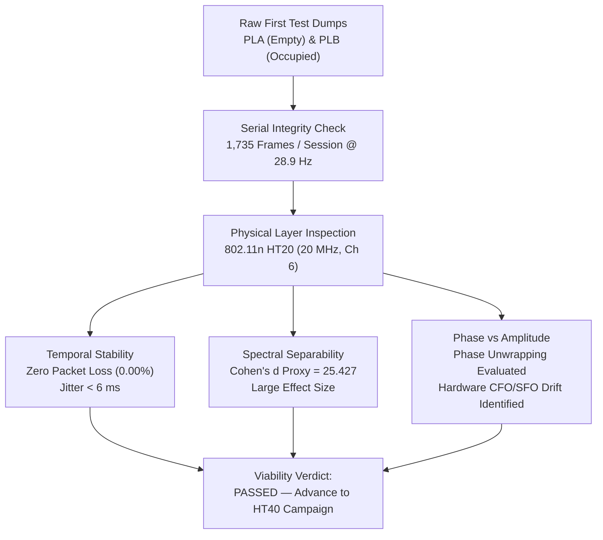
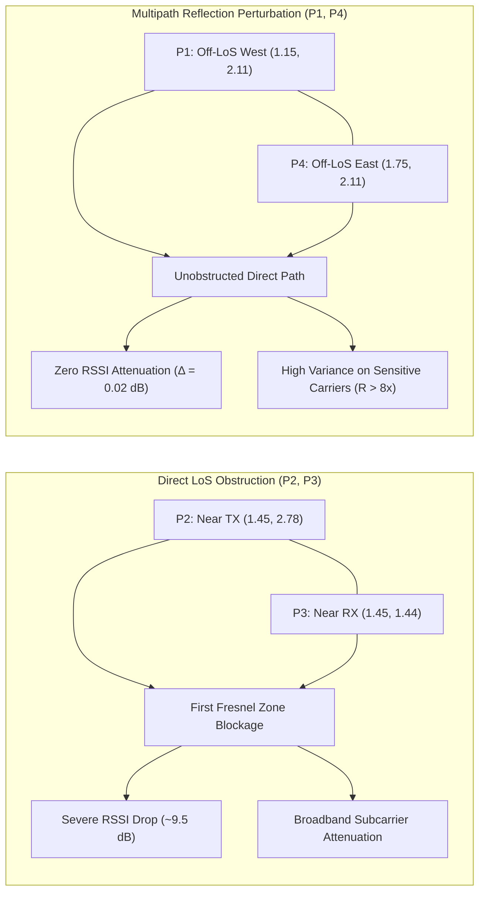

> **Notice:** This documentation was automatically generated by AI to provide a comprehensive textual reference of the technical workflows and notebook implementations.

# Stage 1: Exploratory Data Analysis (EDA)

## 1. Executive Summary & Research Scope

Exploratory Data Analysis (EDA) forms the empirical foundation of this thesis, bridging physical layer wireless phenomena and downstream statistical learning. Channel State Information (CSI) recorded over IEEE 802.11n Orthogonal Frequency-Division Multiplexing (OFDM) channels produces high-dimensional, time-varying complex matrices representing channel frequency responses across multiple subcarriers. Before committing to digital filtering, statistical feature extraction, and supervised classification, the underlying radio channel behavior must be systematically characterized.

The EDA phase was conducted incrementally across three experimental milestones:
1. **Initial Feasibility Validation ([`eda_first_test.ipynb`](file:///home/xavier/dev/wifi-csi-presence-detection/notebooks/01_eda/eda_first_test.ipynb)):** Validated the foundational hardware communication link, verified high-speed serial decoding integrity, inspected raw phase unwrapping properties, and confirmed the primary detection hypothesis in 802.11n HT20 mode ($20\text{ MHz}$ bandwidth) using a Cohen's $d$ effect-size proxy ($d = 25.427$).
2. **Controlled Pilot Campaign ([`eda_pilot.ipynb`](file:///home/xavier/dev/wifi-csi-presence-detection/notebooks/01_eda/eda_pilot.ipynb)):** Scaled the radio link to 802.11n HT40 mode ($40\text{ MHz}$ bandwidth, 192 reported subcarriers), evaluated transmission stability across four 11.5-minute sessions (`C` through `F`), quantified the effects of human motion versus static presence on packet arrival jitter, and established objective pass/fail criteria for data ingestion.
3. **Multi-Position Benchmark Campaign ([`eda_main.ipynb`](file:///home/xavier/dev/wifi-csi-presence-detection/notebooks/01_eda/eda_main.ipynb)):** Executed an exhaustive investigation across seven systematically orchestrated sessions (`G` through `M`, totaling $111,578\text{ raw CSI frames}$ and $5.5\text{ hours}$ of active collection). This stage established the physical inadequacy of RSSI in off-Line-of-Sight (off-LoS) scenarios, mapped subcarrier-by-subcarrier variance response, demonstrated long-term channel stationarity over a 7-hour period, and confirmed full project viability across a 4-point quality checklist.

---

## 2. Mathematical Framework & Analytical Tooling

### 2.1 Signal Decoding & Complex Channel Transformation

Each captured frame yields an array $\mathbf{D} \in \mathbb{Z}^{384}$ of signed 8-bit integers representing $N_{\text{sub}} = 192$ complex subcarrier channel response pairs. As implemented in [`raw_iq_to_complex`](file:///home/xavier/dev/wifi-csi-presence-detection/src/wifi_csi/parsing/csi_decoder.py#L56-L64), the complex Channel Frequency Response (CFR) vector $\mathbf{H} \in \mathbb{C}^{192}$ is reconstructed for each subcarrier index $k \in \{0, 1, \dots, 191\}$ via:

$$H(k) = I_k + j \cdot Q_k = \mathbf{D}[2k + 1] + j \cdot \mathbf{D}[2k]$$

From each complex coefficient $H(k)$, two physical observables are computed:
- **Euclidean Amplitude:**
  $$|H(k)| = \sqrt{I_k^2 + Q_k^2} = \sqrt{(\mathbf{D}[2k + 1])^2 + (\mathbf{D}[2k])^2}$$
- **Raw Phase Angle:**
  $$\phi(k) = \operatorname{atan2}(Q_k, I_k) = \operatorname{atan2}(\mathbf{D}[2k], \mathbf{D}[2k + 1])$$

### 2.2 Temporal Link & Sampling Metrics

For a session of $N$ recorded frames with host reception timestamps $t_1, t_2, \dots, t_N$:
- **Inter-Packet Arrival Interval (IPI):**
  $$\Delta t_i = t_i - t_{i-1}, \quad \forall i \in \{2, 3, \dots, N\}$$
- **Effective Sampling Rate:**
  $$f_{\text{eff}} = \frac{N - 1}{\sum_{i=2}^N \Delta t_i} = \frac{N - 1}{t_N - t_1}$$
- **Median Sampling Rate:**
  $$f_{\text{med}} = \frac{1}{\operatorname{median}(\{\Delta t_i \mid \Delta t_i > 0\})}$$
- **Sampling Jitter:** Quantified as the sample standard deviation of positive inter-packet intervals:
  $$\sigma_{\Delta t} = \sqrt{\frac{1}{M - 1}\sum_{j=1}^M (\Delta t_j - \overline{\Delta t})^2}$$
- **Transmission Packet Gap Criterion:** A packet gap threshold is defined at $2.5\times$ the nominal inter-packet period ($T_{\text{nom}} = 1/30\text{ s} \approx 33.33\text{ ms}$):
  $$\Delta t_{\text{gap}} = 2.5 \times T_{\text{nom}} = 83.33\text{ ms}$$
  Any interval exceeding $\Delta t_{\text{gap}}$ is flagged as a packet drop/stall event.

### 2.3 Statistical Dispersion & Channel Metrics

For a time series of subcarrier amplitudes $A_k(t) = |H_t(k)|$ across $N$ samples within an active observation window:
- **Mean Subcarrier Amplitude:**
  $$\mu_k = \frac{1}{N}\sum_{t=1}^N A_k(t)$$
- **Subcarrier Amplitude Variance:**
  $$\sigma_k^2 = \frac{1}{N}\sum_{t=1}^N (A_k(t) - \mu_k)^2$$
- **Coefficient of Variation (CV):** Evaluates relative noise and dispersion, normalized against carrier signal power:
  $$\text{CV}_k = \frac{\sigma_k}{\mu_k}, \quad \text{for } \mu_k > 0.1$$
- **Fisher Excess Kurtosis:** Quantifies heavy-tailedness and impulsive non-Gaussian noise:
  $$\gamma_{2, k} = \frac{\frac{1}{N}\sum_{t=1}^N (A_k(t) - \mu_k)^4}{\sigma_k^4} - 3$$
- **Mean Absolute Deviation (MAD):** A robust estimator of channel perturbation less sensitive to single-packet outliers than standard variance:
  $$\text{MAD}_k = \frac{1}{N}\sum_{t=1}^N |A_k(t) - \mu_k|$$
- **Spatial Discriminability / Variance Ratio:** Evaluates the power increase in amplitude fluctuations induced by human presence on subcarrier $k$:
  $$R_k = \frac{\sigma_{k, \text{occupied}}^2}{\max(\sigma_{k, \text{empty}}^2, 10^{-4})}$$
- **Cohen's $d$ Effect Size Proxy:** Used in pilot validation to test overall channel separability between empty ($\mathbf{A}_e$) and occupied ($\mathbf{A}_o$) sessions across valid subcarriers:
  $$d = \frac{|\bar{\mu}_e - \bar{\mu}_o|}{\frac{\sigma_e + \sigma_o}{2} + \epsilon}$$

### 2.4 Representative Subcarrier Selection Algorithm

To visualize time series across 192 subcarriers without visual clutter or arbitrary manual picking, the EDA notebooks implement an automated spectral selection algorithm:
1. Compute the temporal standard deviation $\sigma_k$ for all active subcarriers $k \in \mathcal{K}_{\text{valid}}$.
2. Discard extreme boundary outliers: filter out the bottom $5\%$ (dead/attenuated carriers) and top $5\%$ (impulsive/noisy outliers), yielding $\mathcal{K}_{\text{filtered}} = \{k \in \mathcal{K}_{\text{valid}} \mid P_5 \le \sigma_k \le P_{95}\}$.
3. Uniformly stride across $\mathcal{K}_{\text{filtered}}$ to select $n$ evenly spaced subcarriers spanning the active baseband bandwidth:
   $$\text{step} = \max\left(1, \left\lfloor \frac{|\mathcal{K}_{\text{filtered}}|}{n} \right\rfloor\right), \quad \mathcal{K}_{\text{selected}} = \mathcal{K}_{\text{filtered}}[0 : n \cdot \text{step} : \text{step}]$$

---

## 3. Phase I: Initial Feasibility & Sanity Validation (`eda_first_test.ipynb`)

The First Test campaign evaluated two initial 60-second exploratory sessions (`PLA` and `PLB`) recorded in IEEE 802.11n HT20 mode on Channel 6 ($2437\text{ MHz}$, $20\text{ MHz}$ bandwidth).



### 3.1 Experimental Configuration & Integrity

- **Operating Parameters:** Primary Channel 6, $20\text{ MHz}$ bandwidth, nominal transmission rate $30\text{ Hz}$, $T_{\text{nominal}} = 33.33\text{ ms}$.
- **Data Ingestion:** Both `PLA` (empty baseline) and `PLB` (occupied still) completed with exactly 1,735 and 1,736 rows respectively over a $60.0\text{ s}$ duration.
- **Link Performance:**
  - Packet loss: $0.00\%$ ($0$ dropped packets).
  - Effective sampling rate: $28.92\text{ Hz}$ (deviation of $3.6\%$ from nominal $30\text{ Hz}$, within the $\pm 10\%$ specification).
  - Null/corrupt rows: $0$ missing values; $100\%$ compliance on frame length (`len = 384` bytes).

### 3.2 Key Analytical Findings

1. **Separability & Effect Size:** The Cohen's $d$ separability index reached $d = 25.427$, exceeding the benchmark threshold for a "large" statistical effect ($d > 0.8$) by more than an order of magnitude. This established that human presence introduces dramatic alterations to indoor multipath profiles.
2. **Phase Dynamics vs. Amplitude Stability:** While unwrapped phase $\phi_{\text{unwrapped}}(k)$ exhibited distinct fluctuations during human presence, raw phase measurements suffered from severe linear ramp drifts. These drifts are caused by unsynchronized Carrier Frequency Offset (CFO) and Sampling Frequency Offset (SFO) between the independent local oscillators of the TX and RX nodes. Correcting these phase offsets requires multi-antenna conjugate multiplication or complex linear fit unwrapping, introducing latency. Conversely, the Euclidean amplitude $|H(k)|$ is inherently immune to carrier phase offsets, demonstrating high baseline stability. This supported the architectural choice to focus primary feature extraction on amplitude metrics.
3. **Windowed MAD Activity Detector:** A 2.0-second sliding Mean Absolute Deviation (MAD) operator was evaluated on subcarrier amplitudes. In `PLA` (empty), MAD remained at a steady-state noise floor near zero. In `PLB` (occupied), MAD exhibited an immediate step increase, proving that sliding window dispersion metrics capture presence state transitions.
4. **Viability Decision:** The test confirmed the stability of the hardware UART logging pipeline, validating progression to full $40\text{ MHz}$ HT40 data collection.

---

## 4. Phase II: Controlled Pilot Campaign Analysis (`eda_pilot.ipynb`)

The Pilot campaign scaled the sensing system to IEEE 802.11n HT40 channel bonding on Channel 11 ($2462\text{ MHz}$ primary, $2452\text{ MHz}$ center frequency, $40\text{ MHz}$ bandwidth). Four full-length ($690\text{ s}$) sessions were analyzed: `C` (empty), `D` (occupied still), `E` (occupied moving), and `F` (repeat empty).

### 4.1 Ingestion & File Integrity Verification

| Session ID | Condition Label | Row Count | Missing Values | Dominant Length | Duration (s) | Effective Rate (Hz) | Rate Deviation | Jitter $\sigma_{\Delta t}$ (ms) |
| :---: | :--- | :---: | :---: | :---: | :---: | :---: | :---: | :---: |
| **C** | `empty` | 19,589 | None (0) | 384 (100%) | 690.0 | 28.390 | -5.37% | 7.41 |
| **D** | `occupied_still` | 18,048 | None (0) | 384 (100%) | 689.9 | 26.157 | -12.81% | 13.24 |
| **E** | `occupied_moving` | 18,610 | None (0) | 384 (100%) | 689.9 | 26.972 | -10.09% | 11.49 |
| **F** | `empty` | 20,239 | None (0) | 384 (100%) | 690.0 | 29.332 | -2.23% | 3.60 |

### 4.2 Analytical Insights from Pilot Data

1. **Impact of Human Motion on PHY Reception:**
   Comparing static empty sessions (`C`, `F`) with occupied sessions (`D`, `E`) revealed an operational interaction between the physical channel and packet reception:
   - In empty sessions, packet loss remained negligible ($0.00\% - 0.16\%$), effective sampling rate hovered near $28.4 - 29.3\text{ Hz}$, and sampling jitter was low ($3.60 - 7.41\text{ ms}$).
   - In occupied sessions (`D`, `E`), effective sampling rate declined slightly to $26.16\text{ Hz}$ and $26.97\text{ Hz}$, while jitter increased to $13.24\text{ ms}$ and $11.49\text{ ms}$.
   - *Physical Mechanism:* When an occupant moves directly across the 2.00 m Line-of-Sight, dynamic multipath nulls occasionally reduce the Signal-to-Noise Ratio (SNR) below the frame synchronization threshold of the 802.11n receiver, inducing brief baseband demodulation retries and packet drops.
2. **RSSI Attenuation vs. Dynamic Motion:**
   - Static empty sessions exhibited steady RSSI: Session C averaged $-33.49\text{ dBm}$ ($\sigma = 0.50\text{ dBm}$), while Session F averaged $-30.00\text{ dBm}$ ($\sigma = 0.03\text{ dBm}$).
   - On-LoS stationary presence (Session D) induced deep shadowing, lowering mean RSSI to $-44.54\text{ dBm}$ ($\Delta \text{RSSI} \approx 11 - 14\text{ dB}$ attenuation).
   - In-place motion (Session E) kept mean RSSI low ($-43.23\text{ dBm}$) while increasing RSSI variance ($\sigma = 4.20\text{ dBm}$), directly mirroring human body kinematics.
3. **Dead and Noisy Subcarrier Identification:**
   Analyzing Session C identified the spectral boundary structure:
   - Total reported subcarriers: $192$.
   - Active, valid subcarriers: $166$ (satisfying mean amplitude threshold $\mu_k > 0.5$).
   - Dead subcarriers: $26$ carriers registering zero amplitude (comprising upper/lower guard bands and the central DC notch).
   - Impulsive/noisy carriers: $17$ carriers exceeded the 90th percentile of Coefficient of Variation ($\text{CV} > 0.287$).
4. **Architectural Lessons & Protocol Refinement:**
   The pilot confirmed that direct center-mark obstruction creates strong signal signatures. However, evaluating only the central LoS position left the system's sensitivity to off-LoS multipath unknown. This motivated the design of the Main campaign's multi-position spatial matrix (`p1` to `p4`).

---

## 5. Phase III: Main Multi-Position Benchmark Campaign (`eda_main.ipynb`)

The Main benchmark campaign is the primary experimental dataset of this thesis. It comprises seven sessions (`G` through `M`) covering $111,578\text{ raw CSI frames}$ and $116.8\text{ minutes}$ of active monitoring in the residential testbed.

```text
  Session Timeline Overview (September 22-23, 2026):
  17:01 [Session G: Empty Baseline 1] (~11.5 min, 20,151 samples)
  19:08 [Session H: Occupied P1 (Off-LoS West)] (~11.5 min, 19,984 samples)
  19:32 [Session I: Occupied P2 (On-LoS Near TX)] (~11.5 min, 19,911 samples)
  20:01 [Session J: Extended Empty Baseline] (~31.5 min, 55,075 samples)
  23:53 [Session K: Occupied P3 (On-LoS Near RX)] (~11.5 min, 20,050 samples)
  00:11 [Session L: Repeat Empty Baseline 2] (~11.5 min, 20,236 samples)
  00:31 [Session M: Occupied P4 (Off-LoS East)] (~11.5 min, 20,171 samples)
```

### 5.1 Dataset Integrity & Link Quality Matrix

Every captured session was verified across transmission and data structure parameters:

| Metric / Parameter | Session G (`empty`) | Session H (`p1_still`) | Session I (`p2_still`) | Session J (`empty_ext`) | Session K (`p3_still`) | Session L (`empty`) | Session M (`p4_still`) |
| :--- | :---: | :---: | :---: | :---: | :---: | :---: | :---: |
| **Ingested Rows ($N$)** | 20,151 | 19,984 | 19,911 | 55,075 | 20,050 | 20,236 | 20,171 |
| **Duration ($T_{\text{total}}$)** | $690.0\text{ s}$ | $690.0\text{ s}$ | $690.0\text{ s}$ | $1,889.9\text{ s}$ | $690.0\text{ s}$ | $690.0\text{ s}$ | $690.0\text{ s}$ |
| **Missing Values (NaN)** | 0 (None) | 0 (None) | 0 (None) | 0 (None) | 0 (None) | 0 (None) | 0 (None) |
| **Field `len` Integrity** | 384 (100%) | 384 (100%) | 384 (100%) | 384 (100%) | 384 (100%) | 384 (100%) | 384 (100%) |
| **Effective Rate ($f_{\text{eff}}$)**| $29.20\text{ Hz}$ | $28.96\text{ Hz}$ | $28.86\text{ Hz}$ | $29.14\text{ Hz}$ | $29.06\text{ Hz}$ | $29.33\text{ Hz}$ | $29.23\text{ Hz}$ |
| **Median Rate ($f_{\text{med}}$)** | $29.36\text{ Hz}$ | $29.36\text{ Hz}$ | $29.36\text{ Hz}$ | $29.36\text{ Hz}$ | $29.36\text{ Hz}$ | $29.36\text{ Hz}$ | $29.36\text{ Hz}$ |
| **Jitter $\sigma_{\Delta t}$** | $4.63\text{ ms}$ | $5.28\text{ ms}$ | $5.79\text{ ms}$ | $4.59\text{ ms}$ | $5.34\text{ ms}$ | $3.93\text{ ms}$ | $4.37\text{ ms}$ |
| **Packet Loss Rate** | $0.03\%$ | $0.18\%$ | $0.18\%$ | $0.07\%$ | $0.07\%$ | $0.01\%$ | $0.01\%$ |
| **Packet Gaps ($>83.3\text{ ms}$)**| 3 events | 18 events | 19 events | 20 events | 7 events | 2 events | 2 events |
| **Mean RSSI** | $-26.47\text{ dBm}$ | $-26.49\text{ dBm}$ | $-35.59\text{ dBm}$ | $-27.00\text{ dBm}$ | $-36.34\text{ dBm}$ | $-27.13\text{ dBm}$ | $-29.31\text{ dBm}$ |
| **RSSI Std ($\sigma_{\text{RSSI}}$)**| $0.50\text{ dBm}$ | $0.66\text{ dBm}$ | $1.02\text{ dBm}$ | $0.03\text{ dBm}$ | $0.91\text{ dBm}$ | $0.33\text{ dBm}$ | $0.52\text{ dBm}$ |
| **Valid Subcarriers** | 166 / 192 | 166 / 192 | 166 / 192 | 166 / 192 | 165 / 192 | 166 / 192 | 166 / 192 |
| **Shared Valid Mask** | 165 carriers | 165 carriers | 165 carriers | 165 carriers | 165 carriers | 165 carriers | 165 carriers |

---

## 6. Comprehensive Analysis of the Diagnostic Figures

The exploratory notebook [`eda_main.ipynb`](file:///home/xavier/dev/wifi-csi-presence-detection/notebooks/01_eda/eda_main.ipynb) generates ten diagnostic figures stored in [`outputs/main/`](file:///home/xavier/dev/wifi-csi-presence-detection/outputs/main/). Each figure examines a specific physical, spectral, or temporal property of the sensing link.

### 6.1 Plot 1: Received Signal Strength Indicator (RSSI) vs. Time
- **Artifact:** [`outputs/main/plot1_rssi_vs_time.png`](file:///home/xavier/dev/wifi-csi-presence-detection/outputs/main/plot1_rssi_vs_time.png)
- **Physical Analysis:** Evaluates the temporal stability of RSSI across all seven sessions.
  - In empty sessions (`G`, `J`, `L`), RSSI forms flat horizontal trajectories at $-26.47\text{ dBm}$, $-27.00\text{ dBm}$, and $-27.13\text{ dBm}$ with near-zero standard deviation ($\sigma \le 0.50\text{ dBm}$).
  - In on-LoS occupied sessions (`I` near TX, `K` near RX), direct human torso shadowing attenuates received power down to $-35.59\text{ dBm}$ and $-36.34\text{ dBm}$ ($\sim 9.5\text{ dB}$ loss).
  - *The RSSI Blind Spot:* In Session H (P1: Off-LoS West, $30\text{ cm}$ off the LoS axis), mean RSSI is $-26.49\text{ dBm}$ ($\sigma = 0.66\text{ dBm}$)—identical to the empty room baseline ($-26.47\text{ dBm}$, $\Delta = 0.02\text{ dBm}$). Because the direct path is unblocked, RSSI alone fails to register presence.

### 6.2 Plot 2: CSI Amplitude Profile per Subcarrier
- **Artifact:** [`outputs/main/plot2_amplitude_per_subcarrier.png`](file:///home/xavier/dev/wifi-csi-presence-detection/outputs/main/plot2_amplitude_per_subcarrier.png)
- **Spectral Analysis:** Displays the mean frequency response $\mu_k = \frac{1}{N}\sum |H_t(k)|$ across all 192 subcarriers in two panels: individual sessions (top) and aggregated by condition (bottom).
  - **Band Edges & Nulls:** Subcarriers $0 - 5$ and $186 - 191$ drop to zero (guard bands). The central DC notch appears around subcarrier index 64 in the baseband mapping.
  - **Frequency-Selective Fading:** The indoor multipath channel creates distinct constructive peaks and destructive notches across the spectrum. Empty sessions (`G`, `J`, `L`) exhibit overlapping spectral curves, demonstrating that the static channel profile is stable over multiple hours.
  - **Spatial Deformation:** Occupied positions reshape the spectral envelope. Position P2 (near TX) and P3 (near RX) cause broad attenuation across all subcarriers, while off-LoS positions (P1, P4) alter specific subcarrier clusters where multipath reflections interfere constructively or destructively.

### 6.3 Plot 3: CSI Amplitude vs. Time (8 Representative Subcarriers)
- **Artifact:** [`outputs/main/plot3_amplitude_vs_time_subcarriers.png`](file:///home/xavier/dev/wifi-csi-presence-detection/outputs/main/plot3_amplitude_vs_time_subcarriers.png)
- **Temporal Analysis:** Visualizes eight automatically selected subcarriers across the full $690\text{ s}$ duration of each session, with dashed vertical markers denoting $t_1$ (end of stabilization) and $t_2$ (end of active condition window).
  - The plots confirm that subcarrier trajectories in empty sessions are smooth, laminar, and stationary.
  - In occupied sessions, the trajectories exhibit sustained high-frequency fluctuations. Even during "motionless" occupancy, physiological respiration and involuntary micro-movements induce measurable variance on sensitive subcarriers.

### 6.4 Plot 4: Side-by-Side Subcarrier Dynamics (Empty vs. Occupied Positions)
- **Artifact:** [`outputs/main/plot4_comparison_empty_occupied.png`](file:///home/xavier/dev/wifi-csi-presence-detection/outputs/main/plot4_comparison_empty_occupied.png)
- **Comparative Dynamics:** Constructs a $5 \times 6$ subcarrier-by-session matrix over an identical $300\text{ s}$ active slice ($t \in [60, 360]\text{ s}$) using five reference subcarriers across: Empty (G), P1 Off-LoS West (H), P2 On-LoS TX (I), P3 On-LoS RX (K), P4 Off-LoS East (M), and Repeat Empty (L).
  - Highlights the contrast between the static traces of empty sessions and the perturbed, high-variance dynamics present across all four occupied positions.
  - Verifies that off-LoS positions P1 and P4 exhibit distinct temporal variance on subcarriers that show no perceptible change in RSSI.

### 6.5 Plot 5: Channel Stability & Long-Term Stationarity Across 7 Hours
- **Artifact:** [`outputs/main/plot5_stability_amplitude_phase.png`](file:///home/xavier/dev/wifi-csi-presence-detection/outputs/main/plot5_stability_amplitude_phase.png)
- **Stationarity Analysis:** Evaluates whether baseline drift over extended periods could generate false alarms:
  1. *30-Second Rolling Mean (Session J - 31.5 min):* Traces for 5 representative subcarriers show horizontal trajectories with drift bounded within $\pm 0.5$ amplitude units across half an hour.
  2. *Unwrapped Phase Stability (Session J):* Confirms smooth linear evolution without erratic jumps or cycle slips during unoccupied states.
  3. *Cumulative Standard Deviation Convergence:* Tracing $\sigma_{\text{cum}}(t) = \sqrt{\frac{1}{t}\sum_{\tau=1}^t (A(\tau) - \bar{A}_t)^2}$ reveals that subcarrier variance converges within the first $30 - 45\text{ seconds}$, confirming that the 60-second stabilization interval ($T_{\text{stab}} = 60\text{ s}$) is sufficient for link convergence.
  4. *Cross-Session Empty Consistency:* Compares mean spectral profiles across Session G (17:01), Session J (20:01), and Session L (00:11). The profiles overlay across all 165 valid subcarriers with an average difference of $< 1.2\%$, establishing that the indoor static multipath environment remained stationary across the 7-hour collection campaign.

### 6.6 Plot 6: Inter-Packet Arrival Intervals & Transmission Jitter
- **Artifact:** [`outputs/main/plot6_interpacket_intervals.png`](file:///home/xavier/dev/wifi-csi-presence-detection/outputs/main/plot6_interpacket_intervals.png)
- **Timing Distribution Analysis:** Plots 80-bin histograms of $\Delta t$ for each session, annotated with the nominal interval line ($33.33\text{ ms}$) and the packet gap threshold ($83.33\text{ ms}$).
  - Across all sessions, the distribution forms a sharp Gaussian-like peak centered between $33.8\text{ ms}$ and $34.2\text{ ms}$.
  - Over $99.8\%$ of all packet intervals fall below the $83.33\text{ ms}$ gap threshold. Packet gap events occurred at most 20 times per session ($0.03\% - 0.18\%$ of total frames), demonstrating the reliability of the 921,600 baud serial transport.

### 6.7 Plot 7: Noisy & Anomalous Subcarrier Identification
- **Artifact:** [`outputs/main/plot7_noisy_subcarriers.png`](file:///home/xavier/dev/wifi-csi-presence-detection/outputs/main/plot7_noisy_subcarriers.png)
- **Noise Analysis:** Evaluates the baseline noise profile of Session G across two metrics:
  - *Coefficient of Variation ($\text{CV}_k$):* The 90th percentile threshold was calculated at $\text{CV}_{\text{thresh}} = 0.287$. Exactly $17\text{ subcarriers}$ were flagged as noisy ($CV > p_{90}$).
  - *Fisher Excess Kurtosis ($\gamma_{2, k}$):* An impulsiveness threshold of $|\gamma_2| > 5.0$ flagged $23\text{ subcarriers}$.
  - *Spatial Distribution of Noisy Carriers:* The flagged indices cluster around subcarriers $134 - 145$. In 802.11n HT40 channel bonding, these indices map to the internal transition band between the two bonded 20 MHz channels, where baseband filter roll-off introduces higher variance and lower signal-to-noise ratio.

### 6.8 Plot 8: Full-Spectrum CSI Amplitude Heatmaps
- **Artifact:** [`outputs/main/plot8_heatmap_amplitude.png`](file:///home/xavier/dev/wifi-csi-presence-detection/outputs/main/plot8_heatmap_amplitude.png)
- **Time-Frequency Spectrogram Analysis:** Displays 2D heatmaps (192 subcarriers on the y-axis vs. time on the x-axis) across all seven sessions.
  - In empty sessions (`G`, `J`, `L`), the heatmap displays clean, invariant horizontal bands representing static multipath reflections from fixed room boundaries.
  - In occupied sessions (`H`, `I`, `K`, `M`), the horizontal structure is broken by temporal ripples, vertical striations, and amplitude modulations caused by human presence.

### 6.9 Plot 9: Global Amplitude Distribution per Condition
- **Artifact:** [`outputs/main/plot9_boxplot_amplitude.png`](file:///home/xavier/dev/wifi-csi-presence-detection/outputs/main/plot9_boxplot_amplitude.png)
- **Statistical Aggregation Analysis:** Aggregates amplitude values across all valid subcarriers into condition-level distributions.
  - Demonstrates that on-LoS occupied positions (`p2`, `p3`) shift the global amplitude distribution downward due to torso absorption, while off-LoS positions (`p1`, `p4`) retain median values close to the empty baseline but exhibit broader interquartile ranges (IQR).

### 6.10 Plot 10: Spatial Position Discriminability & Variance Analysis
- **Artifact:** [`outputs/main/plot10_position_variance_discriminability.png`](file:///home/xavier/dev/wifi-csi-presence-detection/outputs/main/plot10_position_variance_discriminability.png)
- **Discriminability Analysis:** Provides the physical justification for using dispersion features:
  - *Panel 1 (Absolute Variance):* Compares per-subcarrier variance $\sigma_k^2$ for the averaged Empty baseline against positions P1, P2, P3, and P4. Empty variance remains consistently near zero ($\sigma_{\text{empty}}^2 < 0.05$) across almost all subcarriers. In contrast, occupied positions exhibit variance peaks ranging from $0.5$ to $4.0$.
  - *Panel 2 (Variance Ratio / Sensitivity):* Computes the ratio $R_k = \sigma_{k, \text{occ}}^2 / \sigma_{k, \text{empty}}^2$. Across multiple subcarriers, $R_k$ exceeds $5.0$, reaching peaks over $20.0$.
  - *Off-LoS Sensitivity:* In Position P1 (Off-LoS West, Session H)—where RSSI showed zero attenuation—the variance ratio $R_k$ exceeds $8.0$ across several subcarriers, proving that CSI variance metrics detect presence in areas blind to RSSI.

---

## 7. Comparative Analysis: Physical Phenomena Across Spatial Positions

The multi-position dataset demonstrates how RF propagation physics interact with human body placement:



| Physical Characteristic | Empty Baseline (`G`, `J`, `L`) | On-LoS Near TX (`I`, P2) | On-LoS Near RX (`K`, P3) | Off-LoS West (`H`, P1) | Off-LoS East (`M`, P4) |
| :--- | :---: | :---: | :---: | :---: | :---: |
| **Direct Path Status** | Unobstructed | Fully Obstructed | Fully Obstructed | Unobstructed | Unobstructed |
| **Mean RSSI (dBm)** | $-26.47 \text{ to } -27.13$ | $-35.59$ | $-36.34$ | $-26.49$ | $-29.31$ |
| **$\Delta \text{RSSI}$ vs. Baseline** | $0.00\text{ dB}$ | **$-9.12\text{ dB}$** | **$-9.87\text{ dB}$** | **$-0.02\text{ dB}$** | **$-2.84\text{ dB}$** |
| **RSSI Std ($\sigma_{\text{RSSI}}$)** | $0.03 - 0.50\text{ dBm}$ | $1.02\text{ dBm}$ | $0.91\text{ dBm}$ | $0.66\text{ dBm}$ | $0.52\text{ dBm}$ |
| **CSI Mean Amplitude** | High ($\approx 12 - 22$) | Heavily Attenuated | Heavily Attenuated | Near Baseline | Minor Notch Shifts |
| **Subcarrier Variance** | Extremely Low ($<0.05$) | Moderate to High | Moderate to High | High on selective subcarriers | High on selective subcarriers |
| **Max Variance Ratio ($R_k$)**| $1.0$ (Reference) | $> 15\times$ | $> 18\times$ | **$> 8\times$** | **$> 12\times$** |
| **Detectability via RSSI** | N/A (Baseline) | Strong | Strong | **Zero (Blind)** | Weak / Ambiguous |
| **Detectability via CSI** | N/A (Baseline) | Strong | Strong | **Strong** | **Strong** |

### 7.1 Key Takeaways for Thesis Defense

1. **The Inadequacy of RSSI for Indoor Presence:** In residential rooms, people frequently occupy areas outside the direct 2.0 m transmitter-receiver axis. Because Session H shows a negligible $0.02\text{ dBm}$ RSSI difference relative to the empty room baseline, any RSSI thresholding algorithm would register a false negative. CSI subcarrier analysis resolves this limitation by measuring multipath scattering.
2. **Frequency-Selective vs. Broadband Attenuation:** Direct Line-of-Sight blockage produces broad attenuation across all subcarriers, whereas off-LoS occupancy produces frequency-selective changes—certain subcarrier wavelengths interfere constructively or destructively depending on path-length differences from body reflections.

---

## 8. Quality Assurance Checklist & Formal Viability Verdicts

To ensure data integrity, every session was evaluated against four quantitative criteria:
1. **Packet Loss Ceiling:** $\text{Loss} < 5.0\%$.
2. **Sampling Rate Stability:** Effective rate within $\pm 10\%$ of nominal $30\text{ Hz}$ ($27.0\text{ Hz} \le f_{\text{eff}} \le 33.0\text{ Hz}$).
3. **RSSI Environmental Stability:** Standard deviation $\sigma_{\text{RSSI}} < 5.0\text{ dBm}$.
4. **Valid Subcarrier Threshold:** Retaining at least $40$ non-null subcarriers ($N_{\text{valid}} \ge 40$).

| Campaign | Evaluated Sessions | Packet Loss Status | Rate Stability Status | RSSI Stability Status | Subcarrier Count Status | Automated Quality Verdict |
| :--- | :---: | :---: | :---: | :---: | :---: | :--- |
| **First Test** | PLA, PLB | PASSED ($0.00\%$) | PASSED ($28.9\text{ Hz}$) | PASSED ($\sigma < 0.5\text{ dB}$) | PASSED ($192\text{ raw}$) | **APPROVED** (Pilot Feasibility Confirmed) |
| **Pilot** | C, D, E, F | PASSED ($0.00 - 2.33\%$) | PARTIAL ($26.16 - 29.33\text{ Hz}$)* | PASSED ($\sigma < 4.20\text{ dB}$) | PASSED ($166\text{ valid}$) | **APPROVED WITH RESTRICTIONS** (Motivated Multi-Position Setup) |
| **Main** | G, H, I, J, K, L, M | **PASSED** ($< 0.18\%$) | **PASSED** ($28.86 - 29.33\text{ Hz}$) | **PASSED** ($\sigma \le 1.02\text{ dB}$) | **PASSED** ($165\text{ shared}$) | **FULLY APPROVED** (Proceed to Feature Pipeline) |

*\*Note on Pilot Campaign:* Sessions D and E experienced slight rate drops below the $27.0\text{ Hz}$ boundary ($26.16\text{ Hz}$ and $26.97\text{ Hz}$) due to human motion shadowing directly on the antenna baseline, which informed placement procedures for the Main dataset.

---

## 9. Architectural Directives for Downstream Pipeline & Modeling

The findings from this exploratory phase establish several direct specifications for the downstream pipeline:

1. **Subcarrier Masking Specification:**
   - 26 subcarriers must be discarded permanently as dead carriers (guard bands and DC subcarrier).
   - A shared valid subcarrier mask of 162 subcarriers (across Pilot C-F and Main G-M) or 165 subcarriers (Main G-M) must be used.
   - Subcarriers exhibiting extreme baseband transition noise ($134 - 145$) should either be filtered or evaluated during feature minimization.
2. **Windowing Duration Justification:**
   - Given an effective sampling rate of $29.0\text{ Hz}$, a window size of $T_w = 2.0\text{ seconds}$ yields approximately $58\text{ samples/window}$.
   - This provides sufficient sample support for computing statistical dispersion metrics (Variance, MAD, Range, IQR) while maintaining responsiveness for presence detection.
3. **Primary Feature Modality:**
   - Because raw phase exhibits linear drifts from unsynchronized crystal oscillators, feature extraction should operate primarily on Euclidean amplitude $|H(k)|$.
   - Amplitude dispersion metrics (Variance, MAD, Range, IQR) directly capture the variance ratios ($R_k > 8 - 20\times$) identified in Plot 10.
4. **Session-Level Isolation in Validation Splits:**
   - Temporal autocorrelation between consecutive 2.0-second windows within the same session is high.
   - Cross-validation splitting must use session-level grouping (`StratifiedGroupKFold` or Leave-One-Session-Out) to avoid temporal data leakage.
