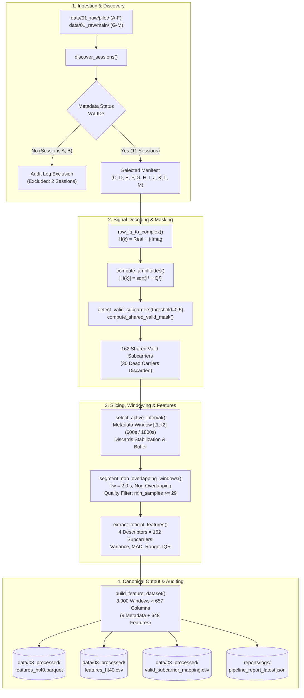
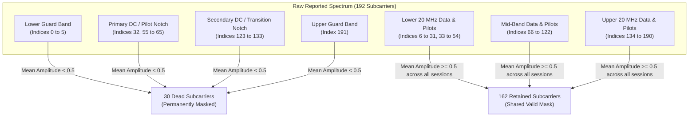

> **Notice:** This documentation was automatically generated by AI to provide a comprehensive textual reference of the technical workflows and notebook implementations.

# Stage 2: Preprocessing and Feature Extraction Pipeline

## 1. Executive Summary & Architectural Scope

The preprocessing and feature extraction pipeline transforms continuous, high-frequency, complex-valued Wi-Fi Channel State Information (CSI) into a calibrated, structured tabular dataset suitable for supervised machine learning. In its raw state, 802.11n Channel State Information arrives as a continuous serial stream of discrete packet observations subject to dead carriers (guard bands and DC subcarriers), high-frequency channel noise, and non-deterministic packet transmission intervals. 

The pipeline stage bridges the gap between raw physical layer RF measurements and machine learning models by establishing a standardized, automated transformation sequence:
1. **Multi-Source Session Discovery & Invalidation Enforcement:** Ingests raw data across experimental campaigns while programmatically excluding invalidated sessions.
2. **Baseband CSI Decoding & Euclidean Amplitude Extraction:** Converts raw interleaved 8-bit integer buffers into complex transfer functions $H(k) = I_k + jQ_k$ and computes instantaneous amplitude $|H(k)|$.
3. **Shared HT40 Subcarrier Mask Calculation:** Identifies active subcarriers across all sessions, filtering out 30 dead subcarriers (guard bands, pilot nulls, and DC carrier) to yield a shared subset of 162 active subcarriers.
4. **Metadata-Driven Active Interval Slicing:** Extracts the steady-state ground-truth window $[t_1, t_2]$, stripping the 60 s stabilization interval and 30 s safety buffer.
5. **Non-Overlapping Window Segmentation:** Segments active streams into fixed $2.0\text{-second}$ temporal windows with sample-count quality checks.
6. **Multi-Descriptor Statistical Feature Extraction:** Extracts four physical dispersion features (Variance, Mean Absolute Deviation, Range, Interquartile Range) per subcarrier, generating a canonical tabular dataset of 648 features across 3,900 windows.

This transformation is implemented across two notebook iterations—[`pipeline_v0.ipynb`](file:///home/xavier/dev/wifi-csi-presence-detection/notebooks/02_pipeline/pipeline_v0.ipynb) (pilot prototype) and [`pipeline_v1.ipynb`](file:///home/xavier/dev/wifi-csi-presence-detection/notebooks/02_pipeline/pipeline_v1.ipynb) (production pipeline)—supported by modular components in `src/wifi_csi/`.



---

## 2. Pipeline Evolution: Prototype (`v0`) vs. Production (`v1`)

The pipeline was developed iteratively to validate algorithms on pilot data before scaling to the combined dataset:

| Dimension / Parameter | Pipeline v0 ([`pipeline_v0.ipynb`](file:///home/xavier/dev/wifi-csi-presence-detection/notebooks/02_pipeline/pipeline_v0.ipynb)) | Pipeline v1 ([`pipeline_v1.ipynb`](file:///home/xavier/dev/wifi-csi-presence-detection/notebooks/02_pipeline/pipeline_v1.ipynb)) | Technical Rationale for Evolution |
| :--- | :--- | :--- | :--- |
| **Operational Scope** | Pilot-only validation prototype | Combined Pilot and Main production pipeline | Validates end-to-end mathematical transformations prior to full benchmark ingestion. |
| **Ingested Campaigns** | `data/01_raw/pilot` | `data/01_raw/pilot` and `data/01_raw/main` | Unifies all valid recordings across experimental phases. |
| **Discovered Sessions** | 6 sessions (`A` through `F`) | 13 sessions (`A` through `M`) | Full coverage of repository raw archives. |
| **Excluded Sessions** | 2 (`A`, `B` due to timing status) | 2 (`A`, `B` due to timing status) | Consistent enforcement of quality criteria. |
| **Processed Sessions** | 4 sessions (`C`, `D`, `E`, `F`) | 11 sessions (`C` through `M`) | Increases sample size from 1,200 to 3,900 windows. |
| **Raw Subcarrier Count**| 192 complex subcarriers | 192 complex subcarriers | Fixed by 802.11n HT40 standard. |
| **Shared Valid Mask** | 162 subcarriers | 162 subcarriers | Consistent valid subcarrier intersection across both campaigns. |
| **Total Windows ($N$)** | 1,200 windows | 3,900 windows | Expanded dataset for cross-validation and testing. |
| **Class Distribution** | Empty: 600 (50%), Occupied: 600 (50%) | Empty: 2,100 (53.8%), Occupied: 1,800 (46.2%)| Incorporates extended baseline session J (900 empty windows). |
| **Feature Dimensionality**| 648 features ($162 \times 4$) | 648 features ($162 \times 4$) | Identical feature space preservation across versions. |
| **Target Storage Paths** | `outputs/pilot/pipeline_v0/` | `data/03_processed/` | Emits the canonical feature dataset for model training. |

---

## 3. Data Ingestion & Metadata Validation Architecture

### 3.1 Automated Session Discovery

The ingestion process in [`discover_sessions`](file:///home/xavier/dev/wifi-csi-presence-detection/src/wifi_csi/parsing/metadata_parser.py#L75-L115) scans configured directory paths for `.csv` raw captures and matches each file with its companion `_meta.json` sidecar:

```python
meta_path = csv_path.with_name(f"{csv_path.stem}_meta.json")
meta = load_metadata(meta_path if meta_path.exists() else None)
```

The function extracts session parameters into a structured manifest table, capturing:
- `dataset_source`: Originating campaign folder (`pilot` or `main`).
- `session_id`: Unique character identifier (`C` to `M`).
- `csv_path` and `metadata_path`: Absolute filesystem locations.
- `label_name`: Fine-grained condition string inferred from metadata or filename.
- `metadata_status`: Operational status flag (`VALID` vs. `INVALID`).
- `invalidation_reason`: Text documenting cause of exclusion.
- `file_size_mb`: Physical file size on disk.

### 3.2 Programmatic Quality Filtering

The pipeline enforces data hygiene through automated rejection rules:
```python
status, invalidation_reason, is_valid = metadata_validation_details(meta, required_status="VALID")
if not is_valid:
    warnings.warn(f"Excluding session {csv_path.name}: {invalidation_reason}")
```

In [`pipeline_v1.ipynb`](file:///home/xavier/dev/wifi-csi-presence-detection/notebooks/02_pipeline/pipeline_v1.ipynb), 13 candidate sessions were discovered:
- **Eligible Sessions (11):** Sessions `C`, `D`, `E`, `F` (from Pilot) and `G`, `H`, `I`, `J`, `K`, `L`, `M` (from Main) passed validation.
- **Excluded Sessions (2):** Pilot sessions `A` and `B` were flagged with `metadata_status: "INVALID"` and omitted from downstream processing:
  - `session_A_empty_20260502_1200.csv`: *"t1 and t2 timestamps do not match expected times based on recording start time and planned duration"*
  - `session_B_empty_20260502_1223.csv`: *"t1 timestamp do not match expected times based on recording start time and planned duration"*

---

## 4. Signal Decoding & Subcarrier Masking

### 4.1 Baseband Array Conversion & Validation

For each valid session, raw CSV rows are ingested through [`load_session_arrays`](file:///home/xavier/dev/wifi-csi-presence-detection/src/wifi_csi/signal/amplitudes.py#L56-L214):
1. **Row-Type Filtering:** Retains rows where `type == "CSI_DATA"`.
2. **Timestamp Verification:** Validates `timestamp_host` against format `%Y%m%dT%H%M%S.%f`. Rows failing timestamp parsing are dropped.
3. **CSI Array Decoding:** Decodes the `data` column JSON string into an array of 384 signed 8-bit integers.
4. **Length Consistency Check:** Enforces that every decoded array matches the expected mode length (`len == 384`). Any corrupted or truncated UART lines are discarded.
5. **Complex Reconstruction & Amplitude Matrix:** Transforms the raw array $\mathbf{D} \in \mathbb{R}^{N \times 384}$ into a complex matrix $\mathbf{H} \in \mathbb{C}^{N \times 192}$ via [`raw_iq_to_complex`](file:///home/xavier/dev/wifi-csi-presence-detection/src/wifi_csi/parsing/csi_decoder.py#L56-L65). The Euclidean amplitude matrix $\mathbf{A} \in \mathbb{R}^{N \times 192}$ is computed via:
   $$\mathbf{A}[t, k] = |H_t(k)| = \sqrt{(\text{Real}(H_t(k)))^2 + (\text{Imag}(H_t(k)))^2}$$

### 4.2 Shared HT40 Valid-Subcarrier Mask

In IEEE 802.11n HT40 mode, the 192 reported subcarriers span data carriers, pilots, guard bands, and DC nulls. Retaining dead or unmodulated subcarriers introduces columns with near-zero power and ill-conditioned variances.

The pipeline implements an automated two-tier subcarrier filtering process:

1. **Per-Session Subcarrier Detection:**
   As defined in [`detect_valid_subcarriers`](file:///home/xavier/dev/wifi-csi-presence-detection/src/wifi_csi/signal/subcarrier_filter.py#L7-L16), subcarrier $k$ is marked valid in session $s$ if its temporal mean amplitude exceeds threshold $\tau = 0.5$:
   $$\mathcal{M}_s(k) = \left( \frac{1}{N_s}\sum_{t=1}^{N_s} \mathbf{A}_s[t, k] > 0.5 \right) \land \left( \frac{1}{N_s}\sum_{t=1}^{N_s} \mathbf{A}_s[t, k] < \infty \right)$$

2. **Shared Subcarrier Intersection:**
   To guarantee a consistent feature space across all sessions, [`compute_shared_valid_mask`](file:///home/xavier/dev/wifi-csi-presence-detection/src/wifi_csi/signal/subcarrier_filter.py#L18-L39) computes the boolean intersection across all $S = 11$ validated sessions:
   $$\mathcal{M}_{\text{shared}}(k) = \bigwedge_{s=1}^S \mathcal{M}_s(k), \quad \forall k \in \{0, 1, \dots, 191\}$$



### 4.3 Structure of Retained vs. Dead Subcarriers

Across all 11 sessions, the intersection retains exactly **162 valid subcarriers**, permanently discarding **30 dead subcarriers**:
- **Lower Guard Band (6 carriers):** Indices `[0, 1, 2, 3, 4, 5]`
- **Primary DC / Pilot Notch (12 carriers):** Indices `[32, 55, 56, 57, 58, 59, 60, 61, 62, 63, 64, 65]`
- **Secondary DC / Transition Notch (11 carriers):** Indices `[123, 124, 125, 126, 127, 128, 129, 130, 131, 132, 133]`
- **Upper Guard Band (1 carrier):** Index `[191]`

The pipeline serializes this index mapping to [`valid_subcarrier_mapping.csv`](file:///home/xavier/dev/wifi-csi-presence-detection/data/03_processed/valid_subcarrier_mapping.csv), linking each retained valid subcarrier index $j \in \{0, 1, \dots, 161\}$ to its original hardware subcarrier index $k \in \{0, 1, \dots, 191\}$.

---

## 5. Active Interval Slicing & Window Segmentation

### 5.1 Metadata-Driven Active Interval Slicing

To eliminate non-stationary boundary transients, the pipeline uses [`select_active_interval`](file:///home/xavier/dev/wifi-csi-presence-detection/src/wifi_csi/signal/segmentation.py#L9-L62) to isolate steady-state condition data using sidecar metadata timestamps:

$$\mathcal{T}_{\text{active}} = \{t \in \mathcal{T}_{\text{recording}} \mid t_1 \le t \le t_2\}$$

- **Discarded Stabilization Phase ($[t_0, t_1)$):** The first $60\text{ seconds}$ are stripped. This removes transceiver Automatic Gain Control (AGC) convergence and physical settling artifacts from operator entry.
- **Retained Active Window ($[t_1, t_2)$):** Exactly $600\text{ seconds}$ ($10.0\text{ minutes}$) for standard sessions (`C`, `D`, `E`, `F`, `G`, `H`, `I`, `K`, `L`, `M`) and $1800\text{ seconds}$ ($30.0\text{ minutes}$) for extended Session `J`.
- **Discarded Safety Buffer ($[t_2, t_3)$):** The final $30\text{ seconds}$ are stripped, protecting the dataset from premature room entry or port teardown noise.
- **Midnight Boundary Rollover:** When session recording spans midnight (such as Session K, where $t_1 = \text{23:54:51}$ and $t_2 = \text{00:04:51}$), the boundary parser automatically increments the date component of $t_2$ by $+1\text{ day}$, ensuring continuous interval slicing.

### 5.2 Non-Overlapping Window Segmentation

Continuous time series are segmented into discrete temporal observation windows using [`segment_non_overlapping_windows`](file:///home/xavier/dev/wifi-csi-presence-detection/src/wifi_csi/signal/segmentation.py#L64-L137):

- **Window Duration:** Fixed window length $T_w = 2.0\text{ seconds}$ (`window_seconds = 2.0`).
- **Stride:** Non-overlapping stride ($\text{step} = T_w = 2.0\text{ s}$). Non-overlapping windows guarantee that each raw CSI packet contributes to exactly one feature observation.
- **Window Boundaries:** Window $m$ spans $[t_{\text{start}}^{(m)}, t_{\text{end}}^{(m)})$ where $t_{\text{end}}^{(m)} = t_{\text{start}}^{(m)} + 2.0\text{ s}$.
- **Minimum Sample Count Quality Filter:** To prevent sparse or stalled transmission intervals from producing biased feature estimates, a window is dropped if its packet count falls below:
  $$N_{\text{samples}}^{(m)} < \max\left(N_{\text{abs\_min}}, \lfloor \alpha \cdot f_{\text{eff}} \cdot T_w \rfloor\right)$$
  where $N_{\text{abs\_min}} = 5$ (`min_absolute_samples_per_window`), $\alpha = 0.5$ (`min_window_sample_rate_fraction`), and $f_{\text{eff}} \approx 29.0\text{ Hz}$. This requires at least $\lfloor 0.5 \times 29 \times 2.0 \rfloor = 29\text{ packets}$ per 2.0 s window.

### 5.3 Empirical Segmentation Results

Across all 11 ingested sessions, the segmentation module yielded clean window counts with zero dropped windows:

| Session ID | Label Name | Condition Window ($s$) | Candidate Windows | Retained Windows | Dropped Windows | Mean Samples / Window |
| :---: | :--- | :---: | :---: | :---: | :---: | :---: |
| **C** | `empty` | 600.0 | 300 | **300** | 0 | 56.78 |
| **D** | `occupied_still` | 600.0 | 300 | **300** | 0 | 52.31 |
| **E** | `occupied_moving` | 600.0 | 300 | **300** | 0 | 53.94 |
| **F** | `empty` | 600.0 | 300 | **300** | 0 | 58.66 |
| **G** | `empty` | 600.0 | 300 | **300** | 0 | 58.41 |
| **H** | `occupied_p1_still` | 600.0 | 300 | **300** | 0 | 57.92 |
| **I** | `occupied_p2_still` | 600.0 | 300 | **300** | 0 | 57.72 |
| **J** | `empty` (extended) | 1,800.0 | 900 | **900** | 0 | 58.28 |
| **K** | `occupied_p3_still` | 600.0 | 300 | **300** | 0 | 58.12 |
| **L** | `empty` | 600.0 | 300 | **300** | 0 | 58.66 |
| **M** | `occupied_p4_still` | 600.0 | 300 | **300** | 0 | 58.46 |
| **Total** | — | **7,800.0 s** | **3,900** | **3,900** | **0** | **57.39** |

- Across all 3,900 windows, sample counts ranged between $36$ and $60$ packets per window ($\mu = 57.39$, $\sigma = 2.81$), with every window exceeding the 29-sample threshold.
- Window-level effective sampling rates averaged $28.71\text{ Hz}$ ($\sigma = 1.38\text{ Hz}$, median $29.38\text{ Hz}$).

---

## 6. Digital Signal Denoising Architecture

The signal processing package provides two optional temporal filtering methods in [`denoise.py`](file:///home/xavier/dev/wifi-csi-presence-detection/src/wifi_csi/signal/denoise.py):

### 6.1 Low-Pass Butterworth Filter

For applications targeting slowly-varying human kinematics while rejecting high-frequency RF noise:
- **Filter Topology:** Forward-backward low-pass Butterworth filter operating along the temporal axis.
- **Implementation:** Uses Second-Order Sections (`sos`) with zero-phase filtering (`scipy.signal.sosfiltfilt`):
  ```python
  sos = signal.butter(order, safe_cutoff_hz, btype="lowpass", fs=sample_rate_hz, output="sos")
  filtered = signal.sosfiltfilt(sos, amplitude_matrix, axis=0)
  ```
- **Filter Parameters:** 3rd order (`order = 3`), cutoff frequency $f_c = 3.0\text{ Hz}$ (`butterworth_cutoff_hz = 3.0`). At $f_s \approx 29.0\text{ Hz}$, the Nyquist frequency is $f_{\text{nyq}} \approx 14.5\text{ Hz}$. A $3.0\text{ Hz}$ cutoff preserves human respiratory rates ($0.2 - 0.5\text{ Hz}$) and typical body displacement dynamics while attenuating high-frequency spectral noise.

### 6.2 Discrete Wavelet Transform Denoising

- **Wavelet Family:** Daubechies 4 (`db4`) orthogonal wavelet.
- **Decomposition Level:** Dynamic decomposition level bounded by signal length:
  $$J = \min(J_{\text{target}}, \lfloor \log_2(N / (L_{\text{filter}} - 1)) \rfloor)$$
- **Thresholding Rule:** Universal VisuShrink thresholding with soft thresholding:
  $$\lambda = \hat{\sigma}_{\text{noise}}\sqrt{2 \ln N}$$
  where noise standard deviation $\hat{\sigma}_{\text{noise}}$ is estimated from the finest detail coefficients via Donoho's median absolute deviation estimator:
  $$\hat{\sigma}_{\text{noise}} = \frac{\operatorname{median}(|d_1|)}{0.6745}$$

### 6.3 Baseline Pipeline Selection: `filter_type = "none"`

In the production configuration ([`configs/pipeline.yaml`](file:///home/xavier/dev/wifi-csi-presence-detection/configs/pipeline.yaml#L22)), filtering is set to `filter_type: "none"`:
- **Preservation of Micro-Kinematic Variance:** Low-pass filtering attenuates high-frequency amplitude excursions induced by subtle postural adjustments, breathing harmonics, and fast limb transitions.
- **Boundary Distortion Avoidance:** Zero-phase IIR filters and wavelet convolutions introduce boundary edge artifacts at window transitions.
- **Feature Robustness:** As established during EDA, raw amplitude dispersion metrics (Variance, MAD, Range, IQR) naturally aggregate signal excursions, rendering pre-filtering redundant while eliminating filtering compute overhead.

---

## 7. Statistical Feature Extraction & Dataset Assembly

### 7.1 Multi-Descriptor Formulation

For each 2.0-second window containing $N$ amplitude observations across 162 retained subcarriers $\mathbf{X} \in \mathbb{R}^{N \times 162}$, [`extract_official_features`](file:///home/xavier/dev/wifi-csi-presence-detection/src/wifi_csi/features/statistical.py#L24-L50) computes four complementary statistical descriptors for each subcarrier column $\mathbf{x} = [x_1, x_2, \dots, x_N]^T$:

1. **Sample Variance (`var`):**
   Measures overall dispersion around the window mean, with Bessel's correction for unbiased estimation:
   $$\text{var}(\mathbf{x}) = s^2 = \frac{1}{N - 1}\sum_{i=1}^N (x_i - \bar{x})^2$$

2. **Mean Absolute Deviation (`mad`):**
   Measures average absolute deviation from the mean. MAD is more robust to single-packet outliers than quadratic variance:
   $$\text{mad}(\mathbf{x}) = \frac{1}{N}\sum_{i=1}^N |x_i - \bar{x}|$$

3. **Peak-to-Peak Range (`range`):**
   Captures the maximum amplitude span within the observation window:
   $$\text{range}(\mathbf{x}) = \max_{1 \le i \le N}(x_i) - \min_{1 \le i \le N}(x_i)$$

4. **Interquartile Range (`iqr`):**
   Non-parametric measure of statistical dispersion, defined as the difference between the 75th and 25th percentiles:
   $$\text{iqr}(\mathbf{x}) = Q_{0.75}(\mathbf{x}) - Q_{0.25}(\mathbf{x})$$

### 7.2 Physical Grouping & Feature Dimensionality

- **Subcarrier Grouping:** For each subcarrier index $j \in \{0, 1, \dots, 161\}$, the four metrics are extracted together, forming a 4-dimensional descriptor vector per carrier:
  $$\mathbf{f}_j = [\text{var}_j, \text{mad}_j, \text{range}_j, \text{iqr}_j]$$
- **Total Feature Count:** Concatenating all 162 subcarriers produces:
  $$D = 162\text{ subcarriers} \times 4\text{ descriptors} = 648\text{ features}$$
- **Feature Naming Specification:** Features follow the canonical format:
  $$\text{sc}\{j:03d\}\_\{\text{descriptor}\} \quad \longrightarrow \quad \text{sc000\_var}, \text{sc000\_mad}, \text{sc000\_range}, \text{sc000\_iqr}, \dots, \text{sc161\_iqr}$$

### 7.3 Schema of Assembled Feature Dataset

The assembled dataset combines 9 operational metadata columns with 648 feature columns, yielding **657 total columns**:

| Column Range | Column Category | Data Type | Field Names / Formats | Purpose |
| :---: | :--- | :---: | :--- | :--- |
| **0 - 8** | **Metadata Headers** | Mixed | `session_id` (str), `source_csv` (str), `label_name` (str), `label` (int), `window_index` (int), `window_start_time` (str), `window_end_time` (str), `n_samples` (int), `effective_rate_hz_window` (float) | Provenance tracking, session-level grouping, temporal indexing, quality auditing |
| **9 - 656** | **CSI Statistical Features** | Float64 | `sc000_var`, `sc000_mad`, `sc000_range`, `sc000_iqr`, ..., `sc161_range`, `sc161_iqr` | ML inputs representing subcarrier-level channel dynamics |

---

## 8. Canonical Artifacts & Serialization

The production pipeline generates four primary artifacts:

```text
wifi-csi-presence-detection/
├── data/03_processed/
│   ├── features_ht40.parquet          # Primary binary columnar dataset (snappy, 3900x657)
│   ├── features_ht40.csv              # Interoperable tabular CSV dataset (3900x657)
│   ├── valid_subcarrier_mapping.csv   # Index mapping table (162 retained -> raw 0-191)
│   └── splits/                        # train.parquet (2730), val.parquet (585), test.parquet (585)
├── reports/logs/
│   └── pipeline_report_latest.json    # Machine-readable audit manifest
└── outputs/pipeline_v1/figures/       # Diagnostic figures (distributions, PCA, heatmaps)
```

1. **[`features_ht40.parquet`](file:///home/xavier/dev/wifi-csi-presence-detection/data/03_processed/features_ht40.parquet):** Primary binary storage format. Uses Snappy compression and columnar layout, providing fast read performance for model training.
2. **[`features_ht40.csv`](file:///home/xavier/dev/wifi-csi-presence-detection/data/03_processed/features_ht40.csv):** Plaintext CSV export maintained for universal cross-platform reproducibility.
3. **[`valid_subcarrier_mapping.csv`](file:///home/xavier/dev/wifi-csi-presence-detection/data/03_processed/valid_subcarrier_mapping.csv):** Two-column mapping table (`valid_subcarrier_index`, `raw_subcarrier_index`) providing traceability between baseband OFDM subcarrier indices and engineered features.
4. **[`pipeline_report_latest.json`](file:///home/xavier/dev/wifi-csi-presence-detection/reports/logs/pipeline_report_latest.json):** Full JSON audit manifest recording pipeline run parameters, discovered sessions, excluded files, per-session metrics, retained subcarrier counts, window tallies, and class distributions.

---

## 9. Quality Assurance & Diagnostic Validation

### 9.1 Class Balance & Dataset Composition

The assembled canonical dataset consists of **3,900 windows** representing **130.0 minutes** of active ground truth:
- **Class 0 (`empty`):** $2,100\text{ windows}$ ($53.85\%$) spanning sessions `C`, `F`, `G`, `J`, and `L`. (Session J contributes 900 windows as an extended baseline).
- **Class 1 (`occupied`):** $1,800\text{ windows}$ ($46.15\%$) spanning sessions `D` (still), `E` (moving), `H` (p1 west), `I` (p2 near TX), `K` (p3 near RX), and `M` (p4 east). Each occupied session contributes exactly 300 windows ($10\text{ minutes}$).
- **Class Balance:** The resulting $53.8\% / 46.2\%$ balance provides a well-conditioned distribution for binary classifiers without requiring synthetic rebalancing (SMOTE).

### 9.2 Automated Pipeline Assertions

[`pipeline_v1.ipynb`](file:///home/xavier/dev/wifi-csi-presence-detection/notebooks/02_pipeline/pipeline_v1.ipynb) executes three programmatic assertions before completing:
1. **Window Temporal Non-Overlap:** Verifies that within each session, all window intervals are strictly non-overlapping:
   $$\operatorname{start}_{m+1} \ge \operatorname{end}_m, \quad \forall m \in \{0, 1, \dots, M - 2\}$$
2. **Feature Dimensionality Check:** Asserts that the feature column count strictly equals $4 \times N_{\text{shared}}$:
   $$\text{len}(\text{feature\_columns}) == 4 \times 162 = 648$$
3. **Numerical Completeness:** Validates that the feature matrix contains zero `NaN`, `Inf`, or null entries.

### 9.3 2D SVD/PCA Diagnostic Projection

To evaluate feature separability prior to model training, the pipeline computes a centered 2D Singular Value Decomposition (PCA) projection across the 648 standardized features:
- **Variance Explained:** The first principal component (PC1) accounts for **79.19%** of total feature variance, while PC2 accounts for **4.60%** (cumulative: **83.79%** across two dimensions).
- **Cluster Structure:**
  - Empty windows form a compact, low-variance cluster centered at $\text{PC1} \approx -1.56$ ($\sigma = 6.36$).
  - Occupied windows exhibit wider dispersion with positive mean $\text{PC1} \approx +1.82$ ($\sigma = 32.54$), capturing the broad variance introduced across different human positions and kinematics.
- **Diagnostic Outcome:** Confirms that the four dispersion features provide strong linear separability between presence states.

---

## 10. Architectural Directives for Modeling & Validation

The output of the pipeline establishes direct inputs for the downstream modeling stage:

1. **Standardization Specification:** Because the four feature descriptors operate on different mathematical scales (e.g., quadratic Variance vs. linear Range and MAD), feature matrices must be standardized ($z = (x - \mu) / \sigma$) using a `StandardScaler` fitted strictly on training splits.
2. **Session-Grouped Splitting Mandate:** Because consecutive 2.0-second windows within the same session exhibit temporal autocorrelation, standard random train/test splits risk optimistic performance estimation. Splitting must use stratified group partitioning (`StratifiedGroupKFold`) or held-out session isolation.
3. **Feature Minimization Baseline:** The 648-feature dataset serves as the full baseline against which feature selection and subcarrier pruning algorithms (e.g., recursive feature elimination, random forest importance) are evaluated.
