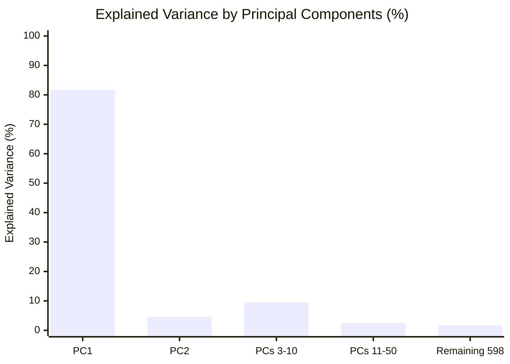
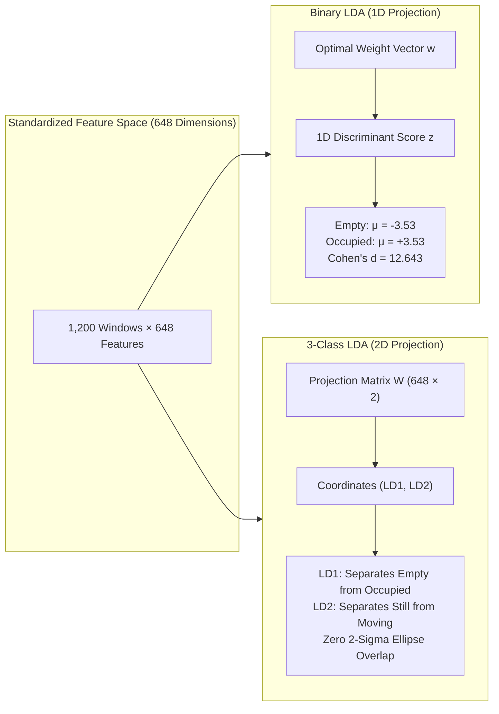

> **Notice:** This documentation was automatically generated by AI to provide a comprehensive textual reference of the technical workflows and notebook implementations.

# Stage 3: Class Separability and Discriminability Analysis

## 1. Executive Summary & Analytical Scope

The class separability analysis stage investigates the geometric and statistical properties of the engineered 648-dimensional feature space. Before committing computational resources to machine learning model selection, hyperparameter tuning, and cross-validation, it is essential to determine whether the extracted statistical dispersion features (Variance, Mean Absolute Deviation, Range, and Interquartile Range) provide sufficient separability between presence states.

This stage is addressed across two complementary notebooks in `notebooks/03_analysis/`:
1. **Feature Space Separability & Linear Discriminant Analysis ([`separability_lda.ipynb`](file:///home/xavier/dev/wifi-csi-presence-detection/notebooks/03_analysis/separability_lda.ipynb)):** Applies unsupervised Principal Component Analysis (PCA) and supervised Linear Discriminant Analysis (LDA) to evaluate class clustering. It performs parametric (ANOVA F-tests) and non-parametric (Mann-Whitney U, Kruskal-Wallis H) statistical hypothesis tests, constructs correlation pairplots, and identifies the most discriminative OFDM subcarriers across both binary (`empty` vs. `occupied`) and 3-class (`empty`, `occupied_still`, `occupied_moving`) taxonomies.
2. **Physical Signal Dynamics & Publication Figures ([`separability_figures.ipynb`](file:///home/xavier/dev/wifi-csi-presence-detection/notebooks/03_analysis/separability_figures.ipynb)):** Resolves methodological considerations regarding baseline selection, formulates temporal aggregation statistics, and generates publication-grade multi-panel figures ([`outputs/pilot/figures/final_figure.png`](file:///home/xavier/dev/wifi-csi-presence-detection/outputs/pilot/figures/final_figure.png) and `.pdf`) illustrating median subcarrier amplitude, interquartile range (IQR) envelopes, and windowed Mean Absolute Deviation (MAD) time series.

The analysis demonstrates that human presence introduces dramatic linear separability in the engineered feature space (binary LDA Cohen's $d = 12.643$), that dynamic motion is clearly distinguishable from stationary presence ($d = 4.232$ on peak-to-peak Range), and that feature sensitivity is heavily concentrated in the upper 20 MHz channel of the 802.11n HT40 band.

---

## 2. Mathematical Framework & Statistical Tooling

### 2.1 Feature Standardization

Let $\mathbf{X} \in \mathbb{R}^{N \times D}$ denote the feature matrix comprising $N = 1,200\text{ windows}$ and $D = 648\text{ features}$ ($162\text{ subcarriers} \times 4\text{ descriptors}$). Because the descriptors possess distinct physical units and numerical scales (quadratic sample variance vs. linear amplitude deviations), the feature space is centered and scaled to zero mean and unit variance via `StandardScaler`:

$$\tilde{x}_{i, j} = \frac{x_{i, j} - \mu_j}{\sigma_j}, \quad \mu_j = \frac{1}{N}\sum_{i=1}^N x_{i, j}, \quad \sigma_j = \sqrt{\frac{1}{N}\sum_{i=1}^N (x_{i, j} - \mu_j)^2}$$

### 2.2 Principal Component Analysis (PCA)

Unsupervised dimensionality reduction is performed via eigendecomposition of the empirical covariance matrix $\mathbf{\Sigma} = \frac{1}{N - 1}\tilde{\mathbf{X}}^T\tilde{\mathbf{X}} \in \mathbb{R}^{D \times D}$:

$$\mathbf{\Sigma} = \mathbf{V} \mathbf{\Lambda} \mathbf{V}^T$$

where $\mathbf{\Lambda} = \operatorname{diag}(\lambda_1, \lambda_2, \dots, \lambda_D)$ contains sorted eigenvalues ($\lambda_1 \ge \lambda_2 \ge \dots \ge \lambda_D \ge 0$) representing variance along orthogonal principal axes $\mathbf{v}_j$. The fraction of total variance explained by the $k$-th principal component is:

$$\text{EVR}_k = \frac{\lambda_k}{\sum_{j=1}^D \lambda_j}$$

### 2.3 Linear Discriminant Analysis (LDA)

Supervised dimensionality reduction is executed to find an optimal linear projection matrix $\mathbf{W}$ that maximizes class separability according to Fisher's criterion:

$$J(\mathbf{W}) = \frac{\det(\mathbf{W}^T \mathbf{S}_B \mathbf{W})}{\det(\mathbf{W}^T \mathbf{S}_W \mathbf{W})}$$

- **Between-Class Scatter Matrix ($\mathbf{S}_B \in \mathbb{R}^{D \times D}$):**
  $$\mathbf{S}_B = \sum_{c=1}^C N_c (\boldsymbol{\mu}_c - \bar{\boldsymbol{\mu}})(\boldsymbol{\mu}_c - \bar{\boldsymbol{\mu}})^T$$
- **Within-Class Scatter Matrix ($\mathbf{S}_W \in \mathbb{R}^{D \times D}$):**
  $$\mathbf{S}_W = \sum_{c=1}^C \sum_{i \in \mathcal{C}_c} (\mathbf{x}_i - \boldsymbol{\mu}_c)(\mathbf{x}_i - \boldsymbol{\mu}_c)^T$$

where $C$ is the number of classes, $N_c$ is the sample count in class $c$, $\boldsymbol{\mu}_c$ is the class mean vector, and $\bar{\boldsymbol{\mu}}$ is the overall dataset mean.
- For binary classification ($C = 2$), the projection is one-dimensional ($\mathbf{w} \in \mathbb{R}^{D \times 1}$), mapping each 648-dimensional observation to a scalar discriminant score $z = \mathbf{w}^T \mathbf{x}$.
- For 3-class classification ($C = 3$), the projection spans $C - 1 = 2$ dimensions ($\mathbf{W} \in \mathbb{R}^{D \times 2}$), yielding coordinates $(\text{LD1}, \text{LD2})$.

### 2.4 Statistical Hypothesis Testing & Effect Size

1. **One-Way ANOVA F-Statistic (Parametric Discriminability):**
   Evaluates the ratio of between-class variance to within-class variance for each individual feature column $j \in \{1, 2, \dots, D\}$:
   $$F_j = \frac{\text{MS}_{\text{between}, j}}{\text{MS}_{\text{within}, j}} = \frac{\frac{1}{C - 1}\sum_{c=1}^C N_c (\bar{x}_{c, j} - \bar{x}_j)^2}{\frac{1}{N - C}\sum_{c=1}^C \sum_{i \in \mathcal{C}_c} (x_{i, j} - \bar{x}_{c, j})^2}$$
2. **Mann-Whitney U Test (Non-Parametric Two-Sample Test):**
   Tests whether randomly selected values from the occupied class are stochastically larger than values from the empty class without assuming normal distribution.
3. **Kruskal-Wallis H Test (Non-Parametric Multi-Class Test):**
   Evaluates whether the medians of the three condition populations (`empty`, `occupied_still`, `occupied_moving`) differ significantly across ranks:
   $$H = \frac{12}{N(N + 1)}\sum_{c=1}^C \frac{R_c^2}{N_c} - 3(N + 1)$$
4. **Standardized Effect Size (Cohen's $d$):**
   Quantifies the magnitude of physical separation between two population distributions:
   $$d = \frac{|\mu_1 - \mu_2|}{s_p}, \quad s_p = \sqrt{\frac{(N_1 - 1)s_1^2 + (N_2 - 1)s_2^2}{N_1 + N_2 - 2}}$$

---

## 3. Dimensionality Reduction & Linear Separability (`separability_lda.ipynb`)

### 3.1 Unsupervised PCA Decomposition

Principal Component Analysis performed on the standardized 648-dimensional feature space ([`outputs/pilot/figures/sep_01_pca.png`](file:///home/xavier/dev/wifi-csi-presence-detection/outputs/pilot/figures/sep_01_pca.png)) demonstrates that the effective intrinsic dimensionality of the indoor Wi-Fi sensing channel is compact:



- **Scree Plot Analysis:** The first principal component (PC1) accounts for **81.7%** of total variance across all 648 features. The second component (PC2) accounts for **4.6%**, yielding a cumulative explained variance of **86.3%** across just two dimensions.
- **Dimensionality Truncation:** The first 10 components capture **95.8%**, and 50 components capture **98.3%** of the cumulative variance.
- **Physical Interpretation:** Despite extracting 648 separate subcarrier statistics, the high spatial and spectral correlation inherent to multipath propagation means that human presence induces correlated variance shifts across broad clusters of OFDM subcarriers simultaneously.
- **2D Projection Structure:** In the PC1-PC2 plane, the `empty` class forms a tight, high-density cluster centered at negative PC1 values, while `occupied_still` and `occupied_moving` shift along positive PC1 with increasing dispersion along PC2.

### 3.2 Supervised Linear Discriminant Analysis (LDA)

Supervised LDA was evaluated for both binary presence detection and 3-class posture/motion classification ([`outputs/pilot/figures/sep_02_lda.png`](file:///home/xavier/dev/wifi-csi-presence-detection/outputs/pilot/figures/sep_02_lda.png)):



#### Binary 1D LDA Projection
- **Discriminant Score Distribution:** Binary LDA maps the 648 features down to a 1D scalar line ($z = \mathbf{w}^T \mathbf{x}$). The resulting scores span $[-9.67, +9.11]$.
- **Class Separation:** The `empty` distribution forms a Gaussian-like density centered at $\mu_{\text{empty}} = -3.53$, while the `occupied` distribution centers symmetrically at $\mu_{\text{occupied}} = +3.53$.
- **Effect Size:** The pooled standard deviation across the two classes is $s_p = 0.558$, yielding an effect size of:
  $$d = \frac{|3.53 - (-3.53)|}{0.558} = \mathbf{12.643}$$
  In standard statistical literature, $d > 0.8$ denotes a "large" effect size. An effect size of $12.64$ reflects near-total distribution divergence with virtually zero Bayes classification error along the primary discriminant axis.

#### 3-Class 2D LDA Projection
- **Discriminant Axis Roles:** 
  - **LD1 (Horizontal Axis):** Primarily captures *presence vs. absence*. It completely separates the `empty` cluster from both `occupied_still` and `occupied_moving`.
  - **LD2 (Vertical Axis):** Primarily captures *human kinematics*. It cleanly isolates `occupied_still` (static torso obstruction) from `occupied_moving` (dynamic postural shifting).
- **Confidence Ellipses:** Drawing $2\sigma$ confidence ellipses ($95.45\%$ coverage under bivariate normality) around class centroids confirms zero overlap between the three clusters.

---

## 4. Statistical Hypothesis Testing & Feature Evaluation

To understand which mathematical operations contribute most to presence detection and motion differentiation, feature values were aggregated across all 162 valid subcarriers per window:

$$\bar{F}_{\text{desc}} = \frac{1}{162}\sum_{k=0}^{161} f_{k, \text{desc}}, \quad \forall \text{desc} \in \{\text{Variance}, \text{MAD}, \text{Range}, \text{IQR}\}$$

### 4.1 Statistical Test Results Across Descriptors

The table below summarizes parametric and non-parametric tests executed across the 1,200 observation windows:

| Feature Descriptor | Empty Mean ($\mu_e$) | Occupied Mean ($\mu_o$) | Mann-Whitney $U$ | Binary Cohen's $d$ | Kruskal-Wallis $H$ (3-class) | 3-Class $p$-value | Cohen's $d$ (Still vs. Moving) |
| :--- | :---: | :---: | :---: | :---: | :---: | :---: | :---: |
| **Sample Variance (`var`)** | $3.649$ | $16.366$ | $173,772$ | **$0.898$** | $937.9$ | $2.19 \times 10^{-204}$ | **$2.483$** |
| **Mean Absolute Deviation (`mad`)** | $1.165$ | $2.283$ | $175,325$ | **$0.851$** | $974.3$ | $2.72 \times 10^{-212}$ | **$3.777$** |
| **Peak-to-Peak Range (`range`)** | $8.039$ | $10.977$ | $175,479$ | **$0.486$** | $865.4$ | $1.20 \times 10^{-188}$ | **$4.232$** |
| **Interquartile Range (`iqr`)** | $1.832$ | $4.027$ | $173,532$ | **$0.890$** | $963.2$ | $6.92 \times 10^{-210}$ | **$3.215$** |

### 4.2 Analytical Insights from Statistical Testing

1. **Presence Detection Sensitivity (Empty vs. Occupied):**
   - Sample Variance and Interquartile Range achieve the highest binary effect sizes ($d = 0.898$ and $d = 0.890$).
   - Occupancy increases mean subcarrier sample variance by a factor of $4.48\times$ (from $3.649$ to $16.366$) and mean IQR by $2.20\times$ (from $1.832$ to $4.027$).
2. **Kinematic Differentiation (Stationary vs. Moving Occupancy):**
   - Peak-to-Peak Range and Mean Absolute Deviation provide the highest separation between still and moving states, achieving Cohen's $d = 4.232$ and $d = 3.777$ respectively.
   - *Physical Mechanism:* When a person stands still on the Line-of-Sight, the variance within a 2.0-second window is governed primarily by respiratory chest excursions and involuntary postural sway ($1 - 3\text{ cm}$ displacement). When moving ($\pm 30\text{ cm}$), the body traverses multiple Fresnel zone boundaries, inducing full-scale constructive and destructive multipath swings that expand peak-to-peak Range and MAD.
3. **Descriptor Complementarity:**
   The four descriptors are mutually reinforcing: Variance and IQR provide sharp discrimination for presence boundaries, while Range and MAD separate subtle postural micro-movements from larger body displacements.

---

## 5. Per-Subcarrier Discriminability & Spectral Mapping

To determine whether sensitivity to human presence is uniform across the 40 MHz channel or localized to specific OFDM carriers, one-way ANOVA F-statistics were calculated for all $D = 648$ individual features ([`outputs/pilot/figures/sep_04_discriminability_heatmap.png`](file:///home/xavier/dev/wifi-csi-presence-detection/outputs/pilot/figures/sep_04_discriminability_heatmap.png)).

### 5.1 ANOVA F-Statistic Distributions

- **Binary Classification F-Statistics ($F_{\text{bin}}$):**
  - Minimum: $0.0$ (dead or unmodulated carrier boundaries)
  - Median: $169.3$
  - Maximum: **$377.1$** (`sc150_mad`)
- **3-Class Classification F-Statistics ($F_{\text{3cl}}$):**
  - Minimum: $137.8$
  - Median: $1,259.5$
  - Maximum: **$2,253.5$** (`sc150_mad`)

### 5.2 Top Discriminative Features & Subcarrier Ranking

The table below lists the top five features across the entire 648-dimensional feature space ranked by binary ANOVA F-statistic:

| Global Rank | Feature Column Name | Subcarrier Index (Valid) | Subcarrier Index (Raw) | Feature Descriptor | Binary ANOVA $F$ | 3-Class ANOVA $F$ |
| :---: | :--- | :---: | :---: | :---: | :---: | :---: |
| **1** | `sc150_mad` | $150$ | $179$ | Mean Absolute Deviation | **$377.1$** | **$2,253.5$** |
| **2** | `sc150_iqr` | $150$ | $179$ | Interquartile Range | **$375.4$** | **$2,194.2$** |
| **3** | `sc150_var` | $150$ | $179$ | Sample Variance | **$289.4$** | **$1,780.8$** |
| **4** | `sc151_mad` | $151$ | $180$ | Mean Absolute Deviation | **$286.2$** | **$1,745.1$** |
| **5** | `sc075_var` | $75$ | $93$ | Sample Variance | **$280.8$** | **$1,892.4$** |

### 5.3 Top Subcarriers Ranked by Feature Descriptor

Evaluating the top-10 valid subcarrier indices within each descriptor category reveals consistent spectral sensitivity patterns:

- **Variance (`var`):**
  - Valid indices: `[150, 75, 156, 77, 60, 62, 159, 63, 64, 155]`
  - Raw indices: `[179, 93, 185, 95, 78, 80, 188, 81, 82, 184]`
  - F-statistic range: $276.9 - 289.4$
- **Mean Absolute Deviation (`mad`):**
  - Valid indices: `[150, 151, 142, 156, 59, 152, 155, 143, 75, 63]`
  - Raw indices: `[179, 180, 171, 185, 77, 181, 184, 172, 93, 81]`
  - F-statistic range: $269.9 - 377.1$
- **Peak-to-Peak Range (`range`):**
  - Valid indices: `[150, 151, 142, 156, 152, 155, 143, 59, 159, 148]`
  - Raw indices: `[179, 180, 171, 185, 181, 184, 172, 77, 188, 177]`
  - F-statistic range: $254.1 - 342.6$
- **Interquartile Range (`iqr`):**
  - Valid indices: `[150, 151, 142, 156, 152, 59, 155, 143, 75, 63]`
  - Raw indices: `[179, 180, 171, 185, 181, 77, 184, 172, 93, 81]`
  - F-statistic range: $268.4 - 375.4$

### 5.4 Physical RF Interpretation of Spectral Clustering

1. **Upper Band Dominance:** Across all four feature descriptors, the highest F-statistics consistently concentrate between valid indices $140 - 160$ (corresponding to raw subcarrier indices $170 - 189$). In 802.11n HT40 channel allocation on Channel 11, these indices correspond to the upper frequency edge of the channel ($f \approx 2465 - 2472\text{ MHz}$).
2. **Wavelength Sensitivity:** At $2470\text{ MHz}$, the free-space RF wavelength is:
   $$\lambda = \frac{c}{f} = \frac{3 \times 10^8\text{ m/s}}{2.470 \times 10^9\text{ Hz}} \approx 12.15\text{ cm}$$
   At these shorter wavelengths, small physiological displacements (such as $2 - 4\text{ cm}$ chest excursions during inhalation/exhalation) constitute a larger fraction of a full wavelength ($0.25 - 0.35\lambda$), generating larger phase wrap-around and deeper constructive/destructive interference notches.
3. **Mid-Band Resonance Cluster:** A secondary cluster of high F-statistics appears near valid indices $59 - 77$ (raw indices $77 - 95$, $f \approx 2445 - 2452\text{ MHz}$). This cluster aligns with the center of the combined 40 MHz channel, reflecting multipath reflections off the concrete slab ceiling and rear wall.

---

## 6. Physical Signal Dynamics & Publication Figures (`separability_figures.ipynb`)

Notebook [`separability_figures.ipynb`](file:///home/xavier/dev/wifi-csi-presence-detection/notebooks/03_analysis/separability_figures.ipynb) generates the core thesis publication figure ([`outputs/pilot/figures/final_figure.png`](file:///home/xavier/dev/wifi-csi-presence-detection/outputs/pilot/figures/final_figure.png) and `.pdf`) and exports the corresponding window-level dataset ([`outputs/pilot/figures/temporal_series.csv`](file:///home/xavier/dev/wifi-csi-presence-detection/outputs/pilot/figures/temporal_series.csv)).

```text
  Publication Figure Layout (final_figure.png / .pdf):
  ┌────────────────────────────────────────────────────────────────────────┐
  │ Panel 1 (Height Ratio 2.2): Median CSI Amplitude vs. Time (0 to 600 s) │
  │ - Shaded envelopes: Rolling temporal 25th-75th Interquartile Range     │
  │ - Solid lines: Temporal median amplitude across 162 valid subcarriers  │
  │   * Green: Empty (C)       --> High Power (~40.2), Narrow Band (0.72)  │
  │   * Orange: Occupied Still  --> Attenuated (~10.7), Stable Band (0.77)  │
  │   * Blue: Occupied Moving  --> Attenuated (~13.4), Surging Band (7.60) │
  ├────────────────────────────────────────────────────────────────────────┤
  │ Panel 2 (Height Ratio 1.0): Aggregated Window MAD (Tw = 2.0 s)         │
  │ - Green: Empty (C)       --> Low baseline noise floor (~1.17)          │
  │ - Orange: Occupied Still  --> Attenuated, minimal dispersion (~0.58)    │
  │ - Blue: Occupied Moving  --> Dynamic activity spikes (~3.55, peak > 5)  │
  └────────────────────────────────────────────────────────────────────────┘
```

### 6.1 Baseline Methodology: The Empty Condition Strategy

The valid pilot dataset includes two distinct sessions labeled `empty`: Session `C` (collected on 02/05/2026) and Session `F` (collected on 03/05/2026). The notebook evaluates two methodological options for representing the baseline in comparative figures:
- **Option A (Session C Only):** Maximizes temporal and physical validity. Sessions `C`, `D`, and `E` were recorded sequentially on the same afternoon under identical ambient temperature, hardware positioning, door/window states, and external Wi-Fi interference.
- **Option B (Interpolated Average of C and F):** Synthesizes a composite empty baseline by interpolating across days. While smoothing out single-session quirks, cross-day averaging introduces confounding variables (differing background network traffic, slight antenna realignment).
- **Architectural Decision:** **Option A (Session C only)** was selected. In experimental signal processing, isolating the single independent variable (human presence) under identical physical conditions is methodologically superior to synthetic cross-day blending.

### 6.2 Temporal Aggregation Formulation

To accurately reflect temporal signal dispersion without conflating it with frequency-selective fading:
1. **Scalar Median Amplitude:** At each temporal sample $t \in \{1, 2, \dots, N_s\}$, the spatial median across all 162 valid subcarriers is computed:
   $$\bar{A}_{\text{med}}[t] = \operatorname{median}_{k \in \mathcal{K}_{\text{valid}}} (|H_t(k)|)$$
2. **Rolling Temporal Quantiles:** Rolling temporal 25th and 75th percentiles are calculated on the resulting 1D time series $\bar{A}_{\text{med}}[t]$:
   $$Q_{0.25}[t] = \operatorname{percentile}_{25}(\bar{A}_{\text{med}}[t - W : t + W])$$
   $$Q_{0.75}[t] = \operatorname{percentile}_{75}(\bar{A}_{\text{med}}[t - W : t + W])$$
   This ensures strict mathematical ordering ($Q_{0.25}[t] \le \bar{A}_{\text{med}}[t] \le Q_{0.75}[t]$) with zero ordering violations.
3. **Aggregated 2-Second Window MAD:** For each non-overlapping 2.0-second window, the Mean Absolute Deviation is computed per subcarrier and averaged across the valid spectrum:
   $$\text{MAD}_{\text{agg}}^{(m)} = \frac{1}{|\mathcal{K}_{\text{valid}}|}\sum_{k \in \mathcal{K}_{\text{valid}}} \left( \frac{1}{|W_m|}\sum_{t \in W_m} ||H_t(k)| - \bar{A}_k^{(m)}| \right)$$

### 6.3 Physical Analysis of the Generated Temporal Traces

Analysis of the 897 window-level observations in [`outputs/pilot/figures/temporal_series.csv`](file:///home/xavier/dev/wifi-csi-presence-detection/outputs/pilot/figures/temporal_series.csv) ($299\text{ windows} \times 3\text{ conditions}$) yields clear physical distinctions:

| Condition Label | Session ID | Mean Median Amplitude ($\bar{A}_{\text{med}}$) | Mean Temporal $Q_{0.25}$ | Mean Temporal $Q_{0.75}$ | Mean Envelope Width (IQR) | Mean Window $\text{MAD}_{\text{agg}}$ |
| :--- | :---: | :---: | :---: | :---: | :---: | :---: |
| **Empty Baseline** | `C` | **$40.23$** | $39.87$ | $40.61$ | **$0.74$** | $1.17$ |
| **Occupied Still** | `D` | **$10.40$** | $9.90$ | $10.84$ | **$0.94$** | $0.58$ |
| **Occupied Moving** | `E` | **$14.04$** | $10.09$ | $18.18$ | **$8.09$** | **$3.55$** |

1. **Torso Shadowing on Line-of-Sight:**
   Standing directly on the 2.00 m Line-of-Sight path drops the median subcarrier amplitude from $40.23$ (Empty) down to $10.40$ (Occupied Still)—a severe physical power loss of $\approx 11.8\text{ dB}$.
2. **Envelope Expansion as an Activity Indicator:**
   In both `Empty` and `Occupied Still`, the envelope width ($Q_{0.75} - Q_{0.25}$) remains tightly compressed ($0.74$ and $0.94$ respectively). When the subject moves (`Occupied Moving`), the envelope expands by more than an order of magnitude to **$8.09$** ($10.9\times$ wider).
3. **MAD Response to Kinematics:**
   Windowed $\text{MAD}_{\text{agg}}$ averages $3.55$ in the moving session (with peaks exceeding $5.0$), compared to $0.58$ in the static occupied session. This demonstrates that windowed MAD serves as an effective physical activity detector.

---

## 7. Inventory of Generated Analysis Figures & Artifacts

The analysis notebooks produce eight primary figures and datasets stored in [`outputs/pilot/figures/`](file:///home/xavier/dev/wifi-csi-presence-detection/outputs/pilot/figures/):

| Figure File | Source Notebook | Visual Content & Statistical Modality | Primary Thesis Takeaway |
| :--- | :--- | :--- | :--- |
| **`final_figure.png` / `.pdf`** | [`separability_figures.ipynb`](file:///home/xavier/dev/wifi-csi-presence-detection/notebooks/03_analysis/separability_figures.ipynb) | Multi-panel 600 s temporal trace: median amplitude with IQR envelope (top) and windowed MAD (bottom). | Demonstrates the distinct physical signatures of Empty, Still, and Moving conditions over time. |
| **`temporal_series.csv`** | [`separability_figures.ipynb`](file:///home/xavier/dev/wifi-csi-presence-detection/notebooks/03_analysis/separability_figures.ipynb) | Window-level tabular series ($897 \times 7$) containing `median_amp`, `q25`, `q75`, and `mad_agg`. | Provides exact numerical data supporting the thesis publication figure. |
| **`sep_01_pca.png`** | [`separability_lda.ipynb`](file:///home/xavier/dev/wifi-csi-presence-detection/notebooks/03_analysis/separability_lda.ipynb) | 3-panel figure: PCA scree plot, binary scatter (PC1 vs PC2), and 3-class scatter with confidence ellipses. | Confirms low intrinsic dimensionality (2 PCs explain 86.3% of total feature variance). |
| **`sep_02_lda.png`** | [`separability_lda.ipynb`](file:///home/xavier/dev/wifi-csi-presence-detection/notebooks/03_analysis/separability_lda.ipynb) | 2-panel figure: 1D binary LDA KDE density histogram and 2D 3-class LDA scatter with 2-sigma ellipses. | Quantifies class separability (Binary LDA Cohen's $d = 12.643$). |
| **`sep_03_feature_distributions.png`** | [`separability_lda.ipynb`](file:///home/xavier/dev/wifi-csi-presence-detection/notebooks/03_analysis/separability_lda.ipynb) | 4-panel violin + strip plots of aggregated Variance, MAD, Range, and IQR across the three classes. | Compares distribution spreads and confirms non-parametric separability across all descriptors. |
| **`sep_04_discriminability_heatmap.png`** | [`separability_lda.ipynb`](file:///home/xavier/dev/wifi-csi-presence-detection/notebooks/03_analysis/separability_lda.ipynb) | $4 \times 162$ heatmap of ANOVA F-statistics across descriptors and subcarriers. | Identifies spectral clusters of high sensitivity in the upper 20 MHz band. |
| **`sep_04b_discriminability_profile.png`** | [`separability_lda.ipynb`](file:///home/xavier/dev/wifi-csi-presence-detection/notebooks/03_analysis/separability_lda.ipynb) | Subcarrier line profiles comparing Binary vs. 3-Class ANOVA F-statistic curves. | Shows consistent sensitivity peaks across both binary and multi-class formulations. |
| **`sep_05_pairplot.png`** | [`separability_lda.ipynb`](file:///home/xavier/dev/wifi-csi-presence-detection/notebooks/03_analysis/separability_lda.ipynb) | Pairwise scatter matrix ($4 \times 4$) with diagonal KDE density distributions for the 4 aggregated features. | Demonstrates strong bivariate separability between presence states. |
| **`sep_06_top_features.png`** | [`separability_lda.ipynb`](file:///home/xavier/dev/wifi-csi-presence-detection/notebooks/03_analysis/separability_lda.ipynb) | 12-panel violin plot showing distributions for the top 3 subcarriers across each descriptor. | Shows that top-ranked individual subcarriers (e.g. `sc150_mad`) provide clean separation on their own. |

---

## 8. Methodological Implications for Downstream Modeling

The empirical and mathematical findings from this stage establish several direct implications for model training:

1. **Viability of Linear Classifiers:**
   Because 1D Linear Discriminant Analysis achieves a Cohen's $d = 12.643$ and the first two principal components explain $86.3\%$ of feature variance, linear classifiers (such as Linear Support Vector Machines and Logistic Regression) are expected to achieve high classification accuracy without requiring deep non-linear architectures.
2. **Support for Non-Linear Classifiers:**
   While linear separation is strong, the dispersion of occupied states across different positions and kinematics suggests that non-linear models (Multilayer Perceptrons, Gradient Boosted Decision Trees, Random Forests) will provide robust decision boundaries across diverse multipath scenarios.
3. **Foundation for Feature Minimization:**
   The concentration of high ANOVA F-statistics in localized subcarrier clusters (such as valid indices $140 - 160$ and $59 - 77$) suggests that the feature space can be heavily pruned. Downstream feature minimization should be able to reduce the full 648-feature set to a fraction of that size while preserving detection performance.
4. **Separation of Presence from Activity:**
   The large effect sizes observed between `occupied_still` and `occupied_moving` ($d = 4.232$ on Range, $d = 3.777$ on MAD) demonstrate that the sensing link captures not only binary presence, but also provides the physical foundation for secondary activity and motion classification.
