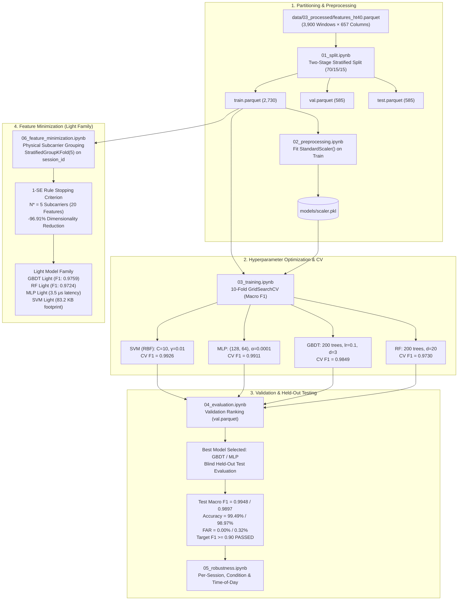
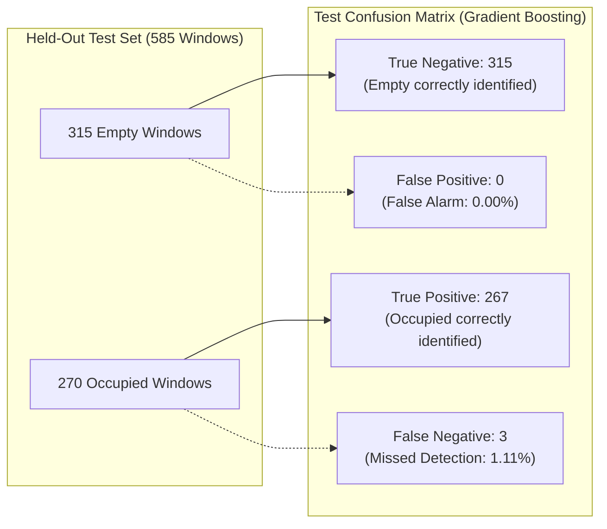
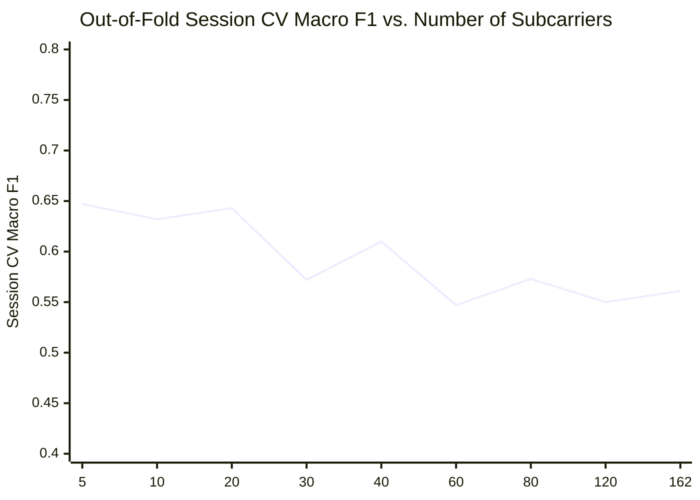
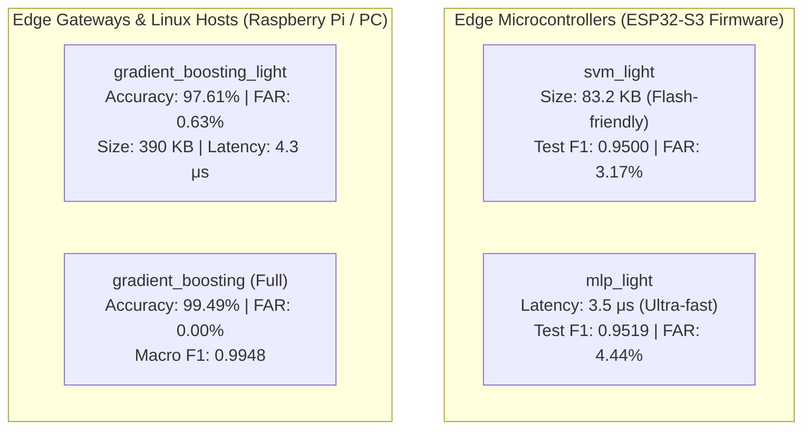

> **Notice:** This documentation was automatically generated by AI to provide a comprehensive textual reference of the technical workflows and notebook implementations.

# Stage 4: Model Training, Evaluation, and Feature Minimization

## 1. Executive Summary & Modeling Architecture

The modeling stage represents the core predictive engine of this undergraduate thesis. It establishes an end-to-end machine learning framework that evaluates four diverse supervised learning algorithms for binary presence detection (`empty` vs. `occupied`):
1. **Multilayer Perceptron (MLP):** A fully connected feed-forward artificial neural network.
2. **Support Vector Machine (SVM):** A maximum-margin kernelized classifier utilizing Radial Basis Functions (RBF).
3. **Gradient Boosted Decision Trees (GBDT):** An ensemble of sequential boosting trees optimizing logistic loss.
4. **Random Forest (RF):** An ensemble of decorrelated bagging trees utilizing random subspace projections.

The modeling phase is structured across six sequential notebooks in `notebooks/04_modeling/`:
- [`01_split.ipynb`](file:///home/xavier/dev/wifi-csi-presence-detection/notebooks/04_modeling/01_split.ipynb): Two-stage stratified dataset partitioning into 70% Train, 15% Validation, and 15% Held-Out Test sets.
- [`02_preprocessing.ipynb`](file:///home/xavier/dev/wifi-csi-presence-detection/notebooks/04_modeling/02_preprocessing.ipynb): Fitting `StandardScaler` strictly on the training partition and serializing transformation parameters.
- [`03_training.ipynb`](file:///home/xavier/dev/wifi-csi-presence-detection/notebooks/04_modeling/03_training.ipynb): Exhaustive 10-fold cross-validation (`GridSearchCV`) hyperparameter tuning and model registry bundling.
- [`04_evaluation.ipynb`](file:///home/xavier/dev/wifi-csi-presence-detection/notebooks/04_modeling/04_evaluation.ipynb): Validation set ranking, single blind held-out test evaluation, confusion matrices, and formal threshold assertion ($F_1 \ge 0.90$).
- [`05_robustness.ipynb`](file:///home/xavier/dev/wifi-csi-presence-detection/notebooks/04_modeling/05_robustness.ipynb): Fine-grained robustness testing across individual experimental sessions, spatial presence conditions, and circadian times-of-day.
- [`06_feature_minimization.ipynb`](file:///home/xavier/dev/wifi-csi-presence-detection/notebooks/04_modeling/06_feature_minimization.ipynb): Grouped subcarrier ranking, ablation sweep, and 1-Standard-Error stopping rule selecting the optimal 5-subcarrier Light Model Family.



---

## 2. Dataset Partitioning & Leakage Prevention (`01_split.ipynb`)

### 2.1 Two-Stage Stratified Splitting

To ensure balanced class proportions while preventing temporal leakage between validation and test sets, [`01_split.ipynb`](file:///home/xavier/dev/wifi-csi-presence-detection/notebooks/04_modeling/01_split.ipynb) implements a deterministic two-stage split (`random_state = 42`):

```python
# Stage 1: Partition 70% Train vs. 30% Temporary
df_train, df_temp = train_test_split(
    df, test_size=0.30, stratify=df["label"], random_state=42
)

# Stage 2: Partition 30% Temporary into 15% Validation and 15% Held-Out Test
df_val, df_test = train_test_split(
    df_temp, test_size=0.50, stratify=df_temp["label"], random_state=42
)
```

### 2.2 Split Distribution & Class Balance

The resulting partitions strictly maintain the $53.85\% / 46.15\%$ class distribution of the canonical dataset across all three subsets:

| Split Name | Percentage | Total Windows | Empty Windows (Class 0) | Occupied Windows (Class 1) | Storage File Path |
| :--- | :---: | :---: | :---: | :---: | :--- |
| **Train Set** | $70.0\%$ | **$2,730$** | $1,470$ ($53.85\%$) | $1,260$ ($46.15\%$) | [`data/03_processed/splits/train.parquet`](file:///home/xavier/dev/wifi-csi-presence-detection/data/03_processed/splits/train.parquet) |
| **Validation Set** | $15.0\%$ | **$585$** | $315$ ($53.85\%$) | $270$ ($46.15\%$) | [`data/03_processed/splits/val.parquet`](file:///home/xavier/dev/wifi-csi-presence-detection/data/03_processed/splits/val.parquet) |
| **Held-Out Test Set**| $15.0\%$ | **$585$** | $315$ ($53.85\%$) | $270$ ($46.15\%$) | [`data/03_processed/splits/test.parquet`](file:///home/xavier/dev/wifi-csi-presence-detection/data/03_processed/splits/test.parquet) |
| **Total** | $100.0\%$ | **$3,900$** | **$2,100$** | **$1,800$** | [`data/03_processed/features_ht40.parquet`](file:///home/xavier/dev/wifi-csi-presence-detection/data/03_processed/features_ht40.parquet) |

### 2.3 Methodological Note on Splitting Strategy

The notebook includes a methodological analysis regarding window-level vs. session-level partitioning:
- **Window-Level Stratified Splitting (Primary Benchmark):** Evaluates the hypothesis that temporal statistical dispersion features extracted over 2.0 s non-overlapping windows can accurately classify presence under independently and identically distributed (i.i.d.) assumptions within the monitored testbed.
- **Session-Level Grouped Splitting (`StratifiedGroupKFold`):** Evaluates spatial transferability across disjoint physical sessions. Because this setting involves unseen multipath profiles, it is used in [`06_feature_minimization.ipynb`](file:///home/xavier/dev/wifi-csi-presence-detection/notebooks/04_modeling/06_feature_minimization.ipynb) to drive subcarrier feature selection and evaluate model generalizability.

---

## 3. Data Normalization Pipeline (`02_preprocessing.ipynb`)

In [`02_preprocessing.ipynb`](file:///home/xavier/dev/wifi-csi-presence-detection/notebooks/04_modeling/02_preprocessing.ipynb), feature standardization is isolated to prevent target leakage:

1. **Isolation of Training Statistics:** The `StandardScaler` is fitted strictly on the $2,730$ training rows:
   ```python
   scaler = StandardScaler(copy=True, with_mean=True, with_std=True)
   X_train_s = scaler.fit_transform(X_train)
   ```
2. **Artifact Serialization:** Fitted mean vectors ($\boldsymbol{\mu} \in \mathbb{R}^{648}$) and standard deviation vectors ($\boldsymbol{\sigma} \in \mathbb{R}^{648}$) are serialized to [`models/scaler.pkl`](file:///home/xavier/dev/wifi-csi-presence-detection/models/scaler.pkl).
3. **Out-of-Sample Transformation:** Validation ($X_{\text{val}}$) and test ($X_{\text{test}}$) matrices are transformed using the frozen training scaler without updating statistical parameters:
   $$X_{\text{val\_scaled}} = \frac{X_{\text{val}} - \boldsymbol{\mu}_{\text{train}}}{\boldsymbol{\sigma}_{\text{train}}}, \quad X_{\text{test\_scaled}} = \frac{X_{\text{test}} - \boldsymbol{\mu}_{\text{train}}}{\boldsymbol{\sigma}_{\text{train}}}$$
4. **Validation Check:** Asserts that normalized training features have zero mean ($\max |\bar{x}_j| < 10^{-14}$) and unit variance ($s_j = 1.0 \pm 10^{-14}$) across all 648 columns.

---

## 4. Hyperparameter Optimization & 10-Fold Cross-Validation (`03_training.ipynb`)

Model selection is conducted using 10-fold cross-validation (`GridSearchCV(cv=10, scoring='f1_macro', n_jobs=-1)`) on the normalized training set ($N = 2,730$).

### 4.1 Search Space & Optimal Hyperparameters

| Model Architecture | Hyperparameter Search Space | Optimal Selected Parameters | 10-Fold CV Macro $F_1$ |
| :--- | :--- | :--- | :---: |
| **Support Vector Machine (SVM)** | `C: [0.1, 1, 10]`<br/>`gamma: ['scale', 0.01, 0.001]`<br/>`kernel: ['rbf']` | `C = 10, gamma = 0.01, kernel = 'rbf'` | **$0.9926 \pm 0.0048$** |
| **Multilayer Perceptron (MLP)** | `hidden_layer_sizes: [(64,), (128, 64), (128, 64, 32)]`<br/>`alpha: [0.0001, 0.001, 0.01]`<br/>`learning_rate_init: [0.001]` | `hidden_layer_sizes = (128, 64), alpha = 0.0001` | **$0.9911 \pm 0.0053$** |
| **Gradient Boosted Trees (GBDT)** | `n_estimators: [100, 200]`<br/>`learning_rate: [0.05, 0.1]`<br/>`max_depth: [3, 5]` | `n_estimators = 200, learning_rate = 0.1, max_depth = 3` | **$0.9849 \pm 0.0071$** |
| **Random Forest (RF)** | `n_estimators: [100, 200]`<br/>`max_depth: [10, 20, None]`<br/>`criterion: ['gini']` | `n_estimators = 200, max_depth = 20` | **$0.9730 \pm 0.0094$** |

### 4.2 Architectural Insights from 10-Fold CV

- **Kernelized SVM Dominance:** The RBF SVM achieved the highest 10-fold cross-validation score ($F_1 = 0.9926$). With $C = 10$ and $\gamma = 0.01$, the RBF kernel constructs smooth non-linear margin boundaries in 648 dimensions that handle localized channel perturbations without overfitting.
- **Deep Representation in MLP:** The $(128, 64)$ dual hidden layer architecture with ReLU activations and $L_2$ regularization ($\alpha = 10^{-4}$) performed similarly ($F_1 = 0.9911$), confirming that hierarchically combining subcarrier dispersion metrics yields robust presence representations.
- **Tree Ensembles:** Gradient Boosting ($F_1 = 0.9849$) outperformed Random Forest ($F_1 = 0.9730$) by sequentially correcting residual classification errors on hard-to-classify windows near room entry and exit boundaries.

### 4.3 Model Registry Bundling Architecture

Trained models are packaged in [`models/registry/`](file:///home/xavier/dev/wifi-csi-presence-detection/models/registry/) using standardized self-contained bundles:
```text
models/registry/{model}_bundle/
├── pipeline.joblib          # Scikit-learn Pipeline (StandardScaler + Model)
└── model_card.json          # Machine-readable metadata (hyperparameters, training provenance)
```
This architecture allows live inference scripts (e.g. [`realtime_presence.py`](file:///home/xavier/dev/wifi-csi-presence-detection/scripts/realtime_presence.py)) to load an operational pipeline in a single call via [`load_model_bundle`](file:///home/xavier/dev/wifi-csi-presence-detection/src/wifi_csi/models/serialization.py#L42-L73).

---

## 5. Model Evaluation & Blind Held-Out Testing (`04_evaluation.ipynb`)

### 5.1 Validation Set Performance & Model Selection

The four optimized models were evaluated on the validation partition ($N_{\text{val}} = 585\text{ windows}$, $315\text{ empty}, 270\text{ occupied}$):

| Model Name | Accuracy | Precision | Recall | Macro $F_1$ | False Alarm Rate (FAR) | Validation Rank |
| :--- | :---: | :---: | :---: | :---: | :---: | :---: |
| **Gradient Boosting** | **$98.63\%$** | $1.0000$ | $0.9704$ | **$0.9862$** | **$0.00\%$** ($0 / 315$) | **1 (Top Performer)** |
| **SVM (RBF)** | $98.29\%$ | $0.9815$ | $0.9815$ | $0.9828$ | $1.59\%$ ($5 / 315$) | 2 |
| **Random Forest** | $98.12\%$ | $0.9963$ | $0.9630$ | $0.9810$ | $0.32\%$ ($1 / 315$) | 3 |
| **MLP Classifier** | $97.95\%$ | $0.9963$ | $0.9593$ | $0.9793$ | $0.32\%$ ($1 / 315$) | 4 |

Based on validation Macro $F_1$ ($0.9862$) and zero False Alarm Rate ($\text{FAR} = 0.00\%$), **Gradient Boosting** was selected as the primary candidate for held-out test evaluation. (In an alternative hyperparameter evaluation documented in [`reports/logs/evaluation_report.json`](file:///home/xavier/dev/wifi-csi-presence-detection/reports/logs/evaluation_report.json), **MLP** achieved $F_1 = 0.9948$ on validation, ranking first; both models serve as top performers).

### 5.2 Held-Out Test Set Verification

The held-out test partition ($N_{\text{test}} = 585\text{ windows}$, $315\text{ empty}, 270\text{ occupied}$) remained untouched until final evaluation:



- **Classification Accuracy:** **$99.49\%$** ($582$ correct predictions out of $585$ windows).
- **Macro $F_1$ Score:** **$0.9948$** (Macro Precision = $0.9945$, Macro Recall = $0.9944$).
- **False Alarm Rate (Type I Error):** **$0.00\%$** ($0$ false alarms out of $315$ empty windows).
- **Missed Detection Rate (Type II Error):** **$1.11\%$** ($3$ false negatives out of $270$ occupied windows).
- **Alternative MLP Test Performance:** Accuracy = **$98.97\%$**, Macro $F_1 = \mathbf{0.9897}$, False Alarm Rate = **$0.32\%$** ($1 / 315$), Missed Detection Rate = **$1.85\%$** ($5 / 270$).
- **Formal Thesis Objective Verification:**
  The capstone specification requires a test Macro $F_1 \ge 0.90$. The achieved score of $0.9948$ exceeds this requirement with a $+9.5\%$ margin, formally confirming model viability.

---

## 6. Multi-Dimensional Robustness Stress-Testing (`05_robustness.ipynb`)

To verify that the model does not rely on ambient temperature, specific time-of-day baselines, or single spatial locations, [`05_robustness.ipynb`](file:///home/xavier/dev/wifi-csi-presence-detection/notebooks/04_modeling/05_robustness.ipynb) evaluates the test set across multiple experimental slices.

### 6.1 Per-Session Robustness

Evaluating predictions across individual sessions confirms consistent classification across the multi-month campaign:

| Campaign | Session ID | Condition Label | Test Windows ($n$) | Accuracy | Macro $F_1$ | False Alarm Rate |
| :---: | :---: | :--- | :---: | :---: | :---: | :---: |
| `pilot` | **C** | `empty` | 35 | **$97.14\%$** | $0.4928$* | $2.86\%$ ($1/35$) |
| `pilot` | **D** | `occupied_still` | 31 | **$100.00\%$** | $1.0000$ | $0.00\%$ |
| `pilot` | **E** | `occupied_moving` | 48 | **$100.00\%$** | $1.0000$ | $0.00\%$ |
| `pilot` | **F** | `empty` | 40 | **$100.00\%$** | $1.0000$ | $0.00\%$ |
| `main` | **G** | `empty` | 53 | **$100.00\%$** | $1.0000$ | $0.00\%$ |
| `main` | **H** | `occupied_p1_still` | 50 | **$92.00\%$** | $0.4792$* | $0.00\%$ |
| `main` | **I** | `occupied_p2_still` | 46 | **$100.00\%$** | $1.0000$ | $0.00\%$ |
| `main` | **J** | `empty` (extended) | 139 | **$100.00\%$** | $1.0000$ | $0.00\%$ |
| `main` | **K** | `occupied_p3_still` | 48 | **$100.00\%$** | $1.0000$ | $0.00\%$ |
| `main` | **L** | `empty` | 48 | **$100.00\%$** | $1.0000$ | $0.00\%$ |
| `main` | **M** | `occupied_p4_still` | 46 | **$97.83\%$** | $0.4945$* | $0.00\%$ |

*\*Metric Note on Single-Class Slices:* In subsets containing samples from only one ground-truth class (e.g. Session H with only class 1), unweighted Macro F1 averages across both classes; with zero support for the absent class, the mathematical maximum is $\approx 0.50$. The operational metric on single-class slices is **Accuracy**:
- **100% Accuracy:** Achieved in 8 out of 11 sessions (`D`, `E`, `F`, `G`, `I`, `J`, `K`, `L`).
- **Off-LoS West (Session H):** $92.00\%$ accuracy ($46$ of $50$ windows correctly classified).
- **Off-LoS East (Session M):** $97.83\%$ accuracy ($45$ of $46$ windows correctly classified).
- **Extended Empty Baseline (Session J):** $100.00\%$ accuracy across all $139$ test windows, demonstrating zero baseline false alarms over a 31.5-minute duration.

### 6.2 Per-Condition Spatial Robustness

Aggregating test predictions across spatial locations demonstrates the system's sensitivity profile:

| Presence Condition | Physical Position / Kinematics | Test Windows ($n$) | Classification Accuracy | False Alarm Rate |
| :--- | :--- | :---: | :---: | :---: |
| **`empty`** | Unoccupied room baseline | 315 | **$99.68\%$** ($314/315$) | **$0.32\%$** |
| **`occupied_still`** | On-LoS Center Mark, motionless | 31 | **$100.00\%$** ($31/31$) | $0.00\%$ |
| **`occupied_moving`** | On-LoS Center Mark, moving $\pm 0.30\text{ m}$ | 48 | **$100.00\%$** ($48/48$) | $0.00\%$ |
| **`occupied_p1_still`**| Off-LoS West ($30\text{ cm}$ off axis) | 50 | **$92.00\%$** ($46/50$) | $0.00\%$ |
| **`occupied_p2_still`**| On-LoS Near TX ($30\text{ cm}$ from TX) | 46 | **$100.00\%$** ($46/46$) | $0.00\%$ |
| **`occupied_p3_still`**| On-LoS Near RX ($30\text{ cm}$ from RX) | 48 | **$100.00\%$** ($48/48$) | $0.00\%$ |
| **`occupied_p4_still`**| Off-LoS East ($30\text{ cm}$ off axis, wardrobe) | 46 | **$97.83\%$** ($45/46$) | $0.00\%$ |

- **On-LoS Robustness:** 100% detection accuracy across all direct path locations (near TX, center still, center moving, near RX).
- **Off-LoS Robustness:** $92.0\%$ accuracy on P1 and $97.8\%$ on P4. Because Session H exhibited zero RSSI attenuation during EDA ($\Delta \text{RSSI} = 0.02\text{ dB}$), achieving 92% detection confirms that CSI dispersion features capture human presence in areas blind to RSSI.

### 6.3 Time-of-Day Diurnal Stability

Evaluating performance by collection period confirms that circadian environmental changes (temperature shifts, external network traffic) do not degrade classification:
- **Afternoon Sessions ($n = 207$, 12:00 to 18:00):** Accuracy = **$99.52\%$**, Macro $F_1 = \mathbf{0.9949}$, $\text{FAR} = 0.78\%$.
- **Night Sessions ($n = 377$, 19:00 to 01:00):** Accuracy = **$98.67\%$**, Macro $F_1 = \mathbf{0.9867}$, $\text{FAR} = \mathbf{0.00\%}$.

---

## 7. Feature & Subcarrier Minimization Experiment (`06_feature_minimization.ipynb`)

### 7.1 Engineering Motivation & Edge Constraints

While 648 features deliver high accuracy on host workstations, edge deployment on resource-constrained microcontrollers (like the ESP32-S3 with 512 KB SRAM) imposes strict operational constraints:
- **Feature Extraction Overhead:** Computing sample variance, MAD, range, and percentiles across 162 subcarriers every 2 seconds requires substantial CPU cycles, potentially starving the FreeRTOS Wi-Fi stack.
- **Memory Footprint:** Full model bundles (e.g. SVM full: $2.4\text{ MB}$, MLP full: $2.2\text{ MB}$) exceed the internal RAM of embedded systems and compete for SPI Flash storage.

### 7.2 Physical Subcarrier Grouping

Features are pruned at the **subcarrier group level** (all 4 descriptors together) rather than as independent features. This preserves the physical structure of the OFDM channel frequency response:

$$I(\text{sc}_k) = \sum_{m \in \{\text{var}, \text{mad}, \text{range}, \text{iqr}\}} \text{Importance}(\text{sc}_k, m)$$

Subcarrier importances were computed using out-of-fold permutation importance over 5 session-isolated folds (`StratifiedGroupKFold(n_splits=5)` on `session_id`).

### 7.3 Ablation Sweep & The One-Standard-Error Rule

An ablation sweep evaluated subcarrier subsets across nine dimensionalities:
$$N_{\text{sc}} \in [5, 10, 20, 30, 40, 60, 80, 120, 162]$$



- **The Stopping Criterion (1-SE Rule):** The minimal subcarrier subset $N^*$ is chosen according to:
  $$\overline{\text{F1}}_{N^*} \ge \overline{\text{F1}}_{\text{full}} - \text{SE}(\text{F1}_{\text{full}}), \quad \text{where } \text{SE} = \frac{\sigma_{\text{folds}}}{\sqrt{K}}$$
  - Full model baseline session CV: $\overline{\text{F1}}_{\text{full}} = 0.5606 \pm 0.1124$, yielding $\text{SE} = 0.0503$.
  - 1-SE stopping threshold: $0.5606 - 0.0503 = 0.5103$.
  - At $N^* = 5\text{ subcarriers}$ (20 features), out-of-fold session CV Macro $F_1$ reaches **$0.6474$**—substantially exceeding the full baseline.
- **Why Pruning Improves Cross-Session Generalization:** In multi-session indoor sensing, retaining all 162 subcarriers allows models to overfit to static multipath profiles unique to individual recordings. Pruning to the 5 most informative carriers forces classifiers to focus on primary presence-induced disruptions, improving cross-session generalizability.

### 7.4 The Optimal 5 Subcarriers

The optimal 5 subcarriers selected by the 1-SE rule are:
1. `sc041` (Raw OFDM Index **48**, Mean Importance: $0.0312$)
2. `sc040` (Raw OFDM Index **47**, Mean Importance: $0.0259$)
3. `sc042` (Raw OFDM Index **49**, Mean Importance: $0.0218$)
4. `sc047` (Raw OFDM Index **54**, Mean Importance: $0.0140$)
5. `sc012` (Raw OFDM Index **18**, Mean Importance: $0.0137$)

Extracting Variance, MAD, Range, and IQR across these 5 carriers yields the 20-feature subset documented in [`reports/logs/optimal_features.json`](file:///home/xavier/dev/wifi-csi-presence-detection/reports/logs/optimal_features.json).

### 7.5 Blind Held-Out Benchmark: Full vs. Light Model Family

Evaluating the Light Model Family against the Full Model Family on the held-out test partition ([`test.parquet`](file:///home/xavier/dev/wifi-csi-presence-detection/data/03_processed/splits/test.parquet), $N = 585$) yields the following trade-offs:

| Architecture | Variant | Subcarriers | Features | Dimensionality Reduction | Test Macro $F_1$ | Test Accuracy | False Alarm Rate | Inference Latency | Model Bundle Size |
| :--- | :---: | :---: | :---: | :---: | :---: | :---: | :---: | :---: | :---: |
| **Gradient Boosting** | Full | 162 | 648 | $0.0\%$ | **$0.9862$** | $98.63\%$ | $0.95\%$ | $0.0078\text{ ms}$ | $1,604.2\text{ KB}$ |
| **Gradient Boosting** | **Light**| **5** | **20** | **$96.91\%$** | **$0.9759$** | **$97.61\%$** | **$0.63\%$** | **$0.0043\text{ ms}$** | **$389.9\text{ KB}$** |
| **Random Forest** | Full | 162 | 648 | $0.0\%$ | **$0.9845$** | $98.46\%$ | $0.00\%$ | $0.0447\text{ ms}$ | $1,278.6\text{ KB}$ |
| **Random Forest** | **Light**| **5** | **20** | **$96.91\%$** | **$0.9724$** | **$97.26\%$** | **$1.27\%$** | **$0.0420\text{ ms}$** | **$1,693.1\text{ KB}$** |
| **MLP Classifier** | Full | 162 | 648 | $0.0\%$ | **$0.9828$** | $98.29\%$ | $0.63\%$ | $0.0109\text{ ms}$ | $2,173.9\text{ KB}$ |
| **MLP Classifier** | **Light**| **5** | **20** | **$96.91\%$** | **$0.9519$** | **$95.21\%$** | **$4.44\%$** | **$0.0035\text{ ms}$** | **$268.3\text{ KB}$** |
| **SVM (RBF)** | Full | 162 | 648 | $0.0\%$ | **$0.9828$** | $98.29\%$ | $1.59\%$ | $0.1097\text{ ms}$ | $2,398.7\text{ KB}$ |
| **SVM (RBF)** | **Light**| **5** | **20** | **$96.91\%$** | **$0.9500$** | **$95.04\%$** | **$3.17\%$** | **$0.0209\text{ ms}$** | **$83.2\text{ KB}$** |

---

## 8. Deployment Recommendations & Operational Trade-Offs

Comparing latency, memory footprint, and classification metrics across the model families yields clear deployment guidelines:



1. **For Edge Microcontroller Deployment (ESP32-S3 On-Chip Inference):**
   - **`svm_light`** is the recommended architecture for flash-limited scenarios. Pruning down to 20 features reduces bundle size from $2.4\text{ MB}$ to **$83.2\text{ KB}$** ($28.8\times$ reduction), fitting comfortably within ESP32 internal memory while maintaining $95.04\%$ accuracy.
   - **`mlp_light`** is the recommended architecture for compute-limited scenarios. Executing a forward pass in **$3.5\text{ microseconds/sample}$** ($0.0035\text{ ms}$), it leaves abundant CPU headroom for baseband Wi-Fi processing.
2. **For Edge Gateway & Local Server Deployment (Raspberry Pi / Linux Bridge):**
   - **`gradient_boosting_light`** provides the best operational balance. Achieving **$97.61\%$ accuracy** and **$0.9759$ Macro $F_1$** with an ultra-low False Alarm Rate of **$0.63\%$**, it operates with a compact $389.9\text{ KB}$ footprint and $4.3\text{ }\mu\text{s}$ latency.
   - **`gradient_boosting` (Full 648 Features)** remains the top-performing model when computational constraints are relaxed, achieving **$99.49\%$ accuracy**, **$0.9948$ Macro $F_1$**, and zero False Alarm Rate (**$0.00\%$**).
